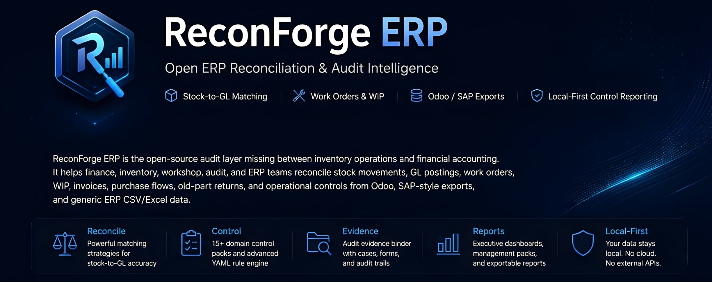
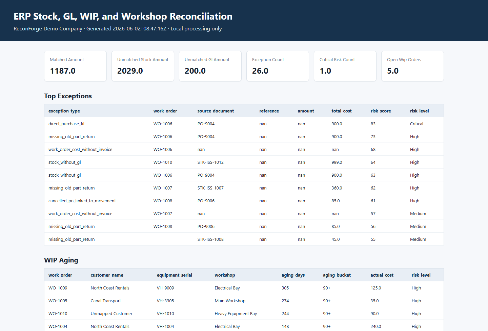
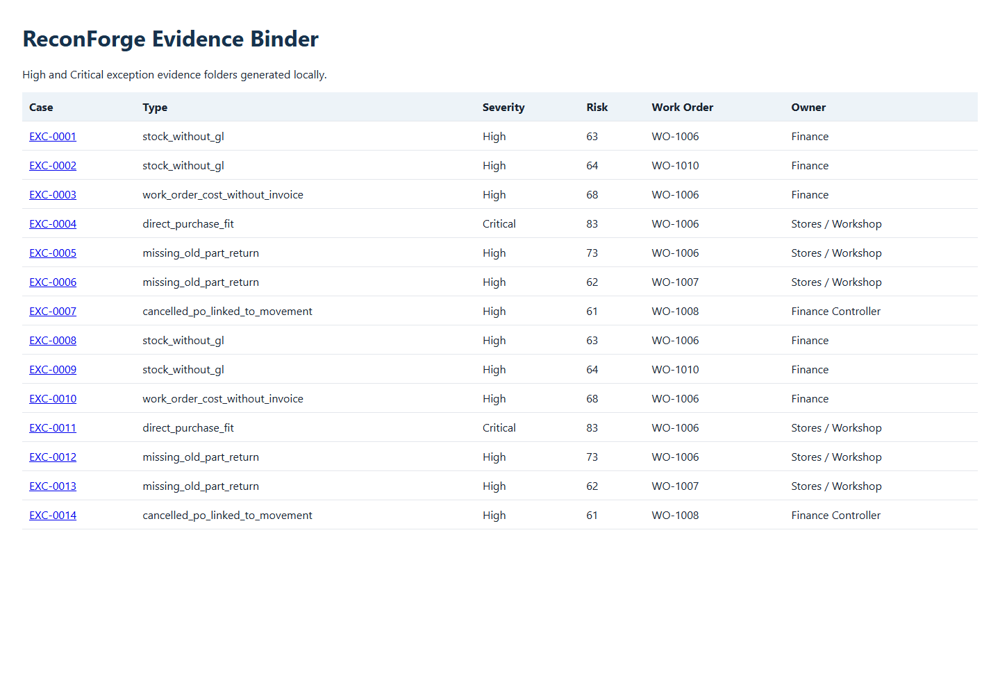
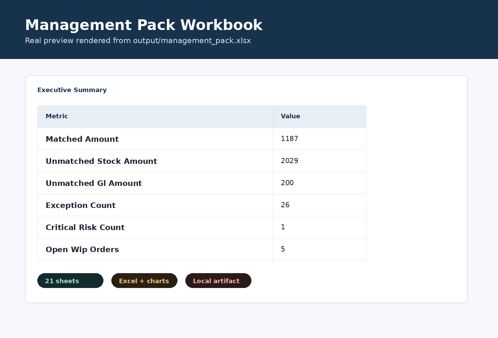
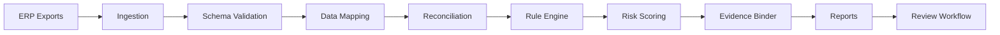

# ReconForge ERP

<p align="center">
  
</p>

<p align="center">
  
  
  
  
  
  
</p>

<p align="center">
  <a href="#visual-preview">Visual Preview</a> ·
  <a href="#quick-start">Quick Start</a> ·
  <a href="#10-minute-demo">10-Minute Demo</a> ·
  <a href="#cli-examples">CLI Examples</a> ·
  <a href="#control-packs">Control Packs</a> ·
  <a href="#documentation">Documentation</a>
</p>

**ReconForge ERP is an open-source ERP reconciliation and audit intelligence platform for local-first stock-to-GL matching, work-order controls, WIP review, Odoo/SAP-style exports, and audit-ready reporting.**

It gives finance, inventory, workshop, ERP, and audit teams a repeatable way to inspect export-based operational controls without uploading sensitive ERP data to a third-party service.

## What It Does

- Reconciles stock movements against GL postings with configurable matching strategies.
- Reviews work orders, WIP, invoices, purchase flows, old-part returns, and workshop control gaps.
- Runs YAML control packs for audit rules, risk scoring, exception explanations, and evidence preparation.
- Helps inspect Odoo/SAP-style export mappings before users edit YAML profiles.
- Tracks local exception review status and compares generated outputs across periods.
- Produces local artifacts: Excel management packs, HTML reports, Markdown summaries, CSV/JSON exports, and evidence binder folders.

## Why It Matters

ERP systems hold the source transactions, but month-end reconciliation often still happens in spreadsheets. ReconForge ERP makes those checks repeatable, inspectable, local, and audit-friendly for teams that need operational controls without a heavy enterprise close platform.

## Core Capabilities

| Area | What ReconForge ERP provides |
| --- | --- |
| Reconciliation | Stock-to-GL matching, amount/date variance checks, unmatched stock and unmatched GL review |
| Workshop controls | Work-order cost review, WIP aging, direct purchase fitting risk, old-part return checks |
| Audit intelligence | Risk scores, risk levels, suggested audit notes, control explanations, evidence binders |
| Rule packs | 18 domain control packs with YAML rules, mappings, expected exceptions, and risk models |
| Reporting | Excel management pack, executive HTML report, static dashboard, Markdown, CSV, and JSON outputs |
| Mapping | Odoo, SAP, ERPNext, Dynamics, and NetSuite export mapping validation plus local header inspection reports |
| Review workflow | Studio review actions, local review state, review register export, and status filtering |
| Period comparison | New, recurring, resolved, escalated, accepted-risk, and trend comparison |
| Handoff | Local client handoff pack with privacy note, redaction controls, and optional checksums |
| Data safety | Local-first processing, anonymized demo data support, evidence integrity manifests, and no API key required for core workflows |

## Visual Preview

The screenshots below are generated from real local ReconForge outputs in this repository, not mockups or stock images.

### Dashboard


Captured from `output/dashboard.html`, showing executive metrics, top exceptions, and WIP aging.

### Executive HTML Report



Captured from `output/executive_report.html`, generated from the same local management-pack workflow.

### Evidence Binder



Captured from `output/evidence/index.html`, listing high and critical exception cases.

### Management Pack Workbook



Rendered from the real `output/management_pack.xlsx` workbook contents.

## Quick Start

```bash
python -m venv .venv
source .venv/bin/activate
pip install -e ".[dev]"

reconforge doctor
reconforge validate examples/sample_data
reconforge report management-pack --input examples/sample_data --config config/reconforge.yml --output output
```

Open the generated local artifacts:

- `output/management_pack.xlsx`
- `output/executive_report.html`
- `output/dashboard.html`
- `output/summary.md`

## 10-Minute Demo

Run the complete first-time-user workflow:

```bash
reconforge demo run --output output/demo
```

Then open:

- `output/demo/executive_report.html`
- `output/demo/management_pack.xlsx`
- `output/demo/review_register.xlsx`
- `output/demo/evidence/index.html`
- `output/demo/client_pack/handoff_summary.md`

Start Studio and update review status locally:

```bash
reconforge studio --input examples/sample_data --output output/demo
```

In Studio, open **Exceptions**, update an exception such as `EXC-0001`, filter by review status, then export or review `output/demo/review_register.xlsx`.

## CLI Examples

```bash
reconforge demo run --output output/demo

reconforge reconcile stock-gl --input examples/sample_data --config config/reconforge.yml --output output
reconforge reconcile stock-gl --input examples/sample_data --config config/reconforge.yml --output output --matching-strategy audit-safe
reconforge reconcile workorders --input examples/sample_data --config config/reconforge.yml --output output

reconforge mappings validate --pack control-packs/odoo-inventory-valuation
reconforge mappings validate --pack control-packs/sap-mb51-fagll03
reconforge mappings validate --pack control-packs/erpnext-stock-gl
reconforge mappings validate --pack control-packs/dynamics-inventory-gl
reconforge mappings validate --pack control-packs/netsuite-inventory-gl
reconforge mappings wizard --input examples/sample_data --pack control-packs/odoo-inventory-valuation --output output/mapping_wizard
reconforge rules validate --pack control-packs/audit-basic
reconforge rules list --pack control-packs/audit-basic
reconforge rules explain --pack control-packs/audit-basic --rule AB-001
reconforge rules run --input examples/sample_data --pack control-packs/audit-basic --output output/rules

reconforge report management-pack --input examples/sample_data --config config/reconforge.yml --output output
reconforge report evidence-binder --input output --output output/evidence
reconforge report client-pack --input output --output output/client_pack
reconforge report client-pack --input output --output output/client_pack_redacted --redact-names --redact-amounts --exclude-raw-records --include-manifest-checksums
reconforge compare periods --inputs output/demo output/demo --output output/period_comparison
reconforge explain exception --input output/management_pack.json --exception-id EXC-0001

reconforge anonymize --input examples/sample_data --output examples/anonymized_data --profile public-demo --amount-noise-percent 5
reconforge generate synthetic --rows 1000 --industry workshop --currency SAR --output benchmarks/small_1k
reconforge benchmark --input benchmarks/small_1k --engine pandas --output output/benchmark
reconforge studio --input examples/sample_data --output output
```

## ERP Mapping Profiles

ReconForge ERP includes export-based mapping profiles for Odoo inventory valuation, SAP MB51/FAGLL03, ERPNext, Microsoft Dynamics, and NetSuite workflows. These profiles help users map local CSV/XLSX exports into the canonical ReconForge files before running stock-to-GL reconciliation, rules, reports, and evidence binder workflows.

- `control-packs/odoo-inventory-valuation` covers Odoo stock moves, stock valuation layers, account move lines, products, work-order references, and invoices where available.
- `control-packs/sap-mb51-fagll03` covers SAP MB51 material documents and FAGLL03/FBL3N G/L line item exports.
- `control-packs/erpnext-stock-gl` covers ERPNext stock ledger, GL entry, and item exports.
- `control-packs/dynamics-inventory-gl` covers Microsoft Dynamics inventory transactions, voucher/GL rows, and released products.
- `control-packs/netsuite-inventory-gl` covers NetSuite inventory activity, GL impact/accounting lines, and item saved searches.
- Core workflows are local-first and do not require cloud upload or direct ERP connectors.
- Use `reconforge mappings wizard` to inspect CSV/XLSX headers and generate `mapping_report.md` plus `mapping_report.json`.

## Local Review Workflow

ReconForge can track exception review state in `output/review_state.json` without a database or cloud service. Use Studio or `reconforge review list`, `reconforge review set-status`, and `reconforge review export` to assign local statuses, reviewer notes, decision reasons, escalation owners, and an Excel review register.

## Multi-Period Comparison

Compare generated output folders to identify new, recurring, resolved, escalated, and accepted-risk items:

```bash
reconforge compare periods --inputs output/jan output/feb --output output/period_comparison
```

The command writes Excel, HTML, JSON, and Markdown outputs. It does not infer savings.

## Report Outputs

| Output | Purpose |
| --- | --- |
| `management_pack.xlsx` | Executive pack, reconciliation summary, risk matrix, exceptions, WIP, audit log, and configuration |
| `executive_report.html` | Local executive HTML report with Control Value Summary |
| `dashboard.html` | Static local dashboard |
| `output/evidence/` | Audit case folders for High and Critical exceptions |
| `output/evidence/evidence_manifest.json` | SHA-256 integrity manifest for generated evidence artifacts |
| `output/review_state.json` | Local exception review status, reviewer notes, and decision metadata |
| `output/review_register.xlsx` | Optional review register exported from local review state |
| `output/rules/` | Rule engine CSV/JSON outputs |
| `output/benchmark/` | Runtime and match-rate benchmark outputs |
| `output/client_pack/` | Local handoff folder with summary, next steps, privacy note, redaction settings, and manifest |

## Who It Is For

- Finance controllers and accountants.
- Internal and external auditors.
- ERP consultants and implementation partners.
- Odoo implementers and SAP users working from exports.
- Inventory, stores, spare-parts, workshop, fleet, dealership, service, and manufacturing teams.

## Maturity Note

ReconForge ERP is early-stage, local-first, and export-based. The current release is **v0.6.1 — Pilot Readiness Hardening**, focused on safer client handoff, evidence integrity, export-profile coverage, demo readiness, and conservative pilot documentation. Docker build workflow support exists, but Docker runtime verification remains a roadmap/release-gate item unless the documented build and run commands pass in a live Docker environment.

## Architecture



See [docs/architecture.md](docs/architecture.md) for system, pipeline, rule engine, evidence, control pack, local deployment, and future open-core diagrams.

## Control Packs

ReconForge ERP ships 18 control packs:

- `audit-basic`
- `odoo-inventory-valuation`
- `sap-mb51-fagll03`
- `erpnext-stock-gl`
- `dynamics-inventory-gl`
- `netsuite-inventory-gl`
- `workshop-spare-parts`
- `fleet-maintenance`
- `manufacturing-wip`
- `dealership-service`
- `service-contracts`
- `purchase-to-pay`
- `inventory-valuation`
- `month-end-close`
- `fixed-assets-spares`
- `multi-warehouse-controls`
- `high-risk-transactions`
- `fraud-red-flags`

Each pack includes metadata, rules, mapping guidance, risk model, README, expected exceptions, and a sample command.

## Evidence Binder

For High and Critical exceptions, the binder creates review-ready case folders:

```text
output/evidence/EXC-0001/
├── summary.md
├── source_records.csv
├── match_candidates.csv
├── triggered_rules.yml
├── recommended_action.md
├── review_form.md
└── audit_trail.json
```

The binder also writes `index.html`, `evidence_index.json`, `evidence_register.xlsx`, and `evidence_manifest.json`.

## Security And Quality

ReconForge ERP processes local files by default. It does not upload ERP exports, does not require paid APIs, and does not require AI services for core functionality. Use the anonymizer before sharing data.

Quality and security checks are part of the repository workflow:

- CI runs Ruff, mypy, pytest, CLI smoke checks, and package build.
- CodeQL analyzes Python on pull requests and scheduled runs.
- Security workflow runs Bandit and `pip-audit`.
- Path-serving routes use registry-based download allowlists instead of constructing filesystem paths from route parameters.

See [SECURITY.md](SECURITY.md), [docs/security-model.md](docs/security-model.md), [docs/security-whitepaper.md](docs/security-whitepaper.md), [docs/redaction-controls.md](docs/redaction-controls.md), [docs/evidence-integrity.md](docs/evidence-integrity.md), [docs/data-privacy.md](docs/data-privacy.md), and [docs/compliance-disclaimer.md](docs/compliance-disclaimer.md).

## Documentation

- [Getting started](docs/getting-started.md)
- [10-minute demo scenarios](docs/demo-scenarios.md)
- [Architecture](docs/architecture.md)
- [Reconciliation methodology](docs/reconciliation-methodology.md)
- [Controls and audit](docs/controls-and-audit.md)
- [Rule-pack schema reference](docs/rule-pack-schema-reference.md)
- [Review workflow](docs/review-workflow.md)
- [ReconForge Studio](docs/reconforge-studio.md)
- [Mapping wizard](docs/mapping-wizard.md)
- [ERP export profiles](docs/erp-export-profiles.md)
- [Multi-period comparison](docs/multi-period-comparison.md)
- [Client handoff pack](docs/client-handoff-pack.md)
- [Redaction controls](docs/redaction-controls.md)
- [Evidence integrity](docs/evidence-integrity.md)
- [Docker deployment](docs/docker-deployment.md)
- [Docker verification report](docs/strategy/docker-verification-report.md)
- [Security whitepaper](docs/security-whitepaper.md)
- [Compliance disclaimer](docs/compliance-disclaimer.md)
- [Synthetic case study](docs/case-studies/workshop-spare-parts-health-check.md)
- [Odoo synthetic case study](docs/case-studies/odoo-stock-valuation-pilot.md)
- [SAP synthetic case study](docs/case-studies/sap-export-reconciliation-pilot.md)
- [Pricing and services](docs/commercial/pricing-and-services.md)
- [Pilot proposal template](docs/commercial/pilot-proposal-template.md)
- [Client onboarding checklist](docs/commercial/client-onboarding-checklist.md)
- [Demo video script](docs/demo-video-script.md)
- [Demo recording checklist](docs/demo-recording-checklist.md)
- [Risk scoring](docs/risk-scoring.md)
- [Report samples](docs/report-samples.md)
- [Anonymization](docs/anonymization.md)
- [Synthetic data](docs/synthetic-data.md)
- [Benchmarking](docs/benchmark.md)
- [Plugin development](docs/plugin-development.md)
- [AI assistant architecture](docs/ai-assistant.md)
- [Odoo export guide](docs/odoo-export-guide.md)
- [SAP export guide](docs/sap-export-guide.md)
- [Plain-English guide](docs/plain-english-guide.md)
- [Arabic guide](docs/ar/guide.md)
- [Playbooks](docs/playbooks/)

## Docker

```bash
docker build -t reconforge-erp .
docker run --rm -v ${PWD}/output:/app/output reconforge-erp reconforge doctor
docker run --rm -v ${PWD}/output:/app/output reconforge-erp reconforge demo run --output output/demo
```

## Quality Checks

```bash
python -m ruff check .
python -m mypy reconforge
python -m pytest
python -m bandit -q -r reconforge
```

## Roadmap

Near-term work: authenticated self-hosted review mode, workbook-level redaction strategy, Docker runtime verification, structured pilot feedback, release artifact signing/SBOM, and deeper ERP export examples.

## Contributing

Contributions are welcome from engineers, ERP consultants, accountants, auditors, and operations teams. Useful contributions include rule packs, mapping templates, anonymized scenarios, tests, documentation, and report improvements. See [CONTRIBUTING.md](CONTRIBUTING.md).

## License

MIT License.
