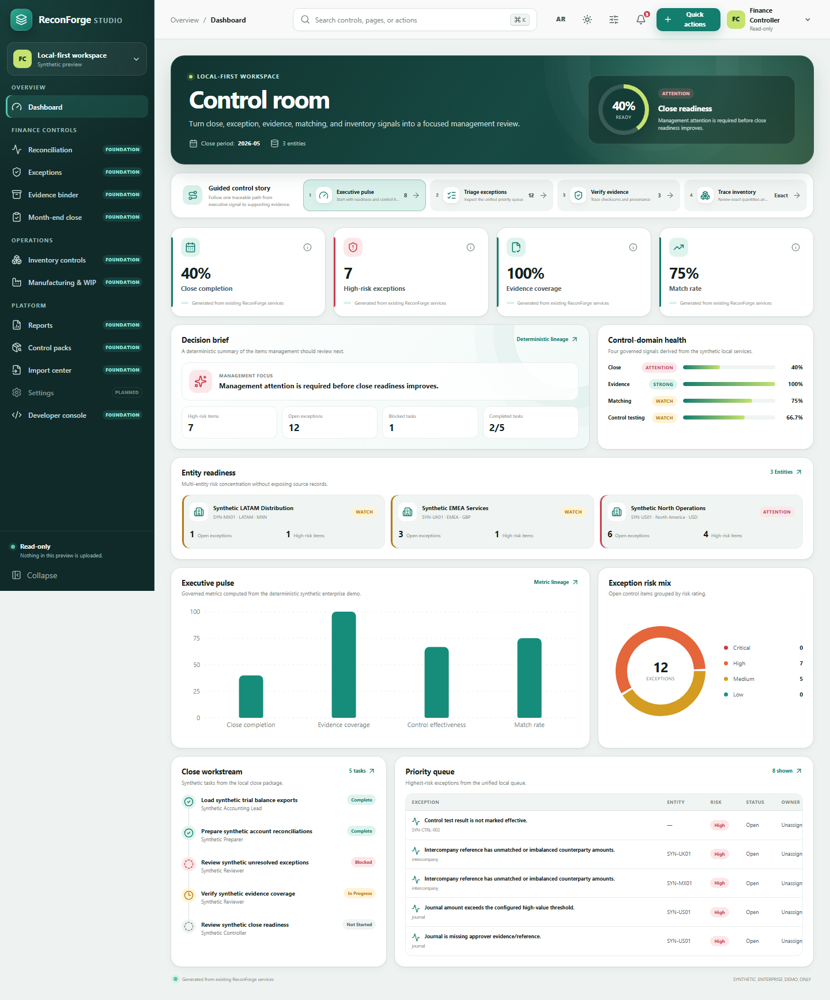
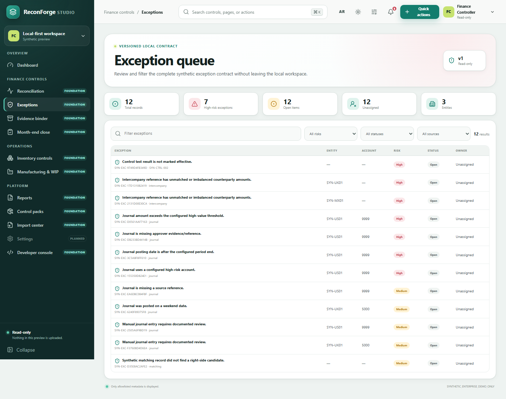
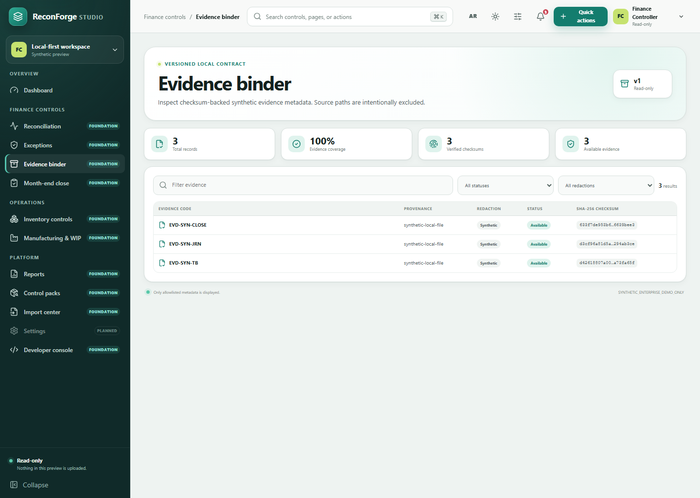
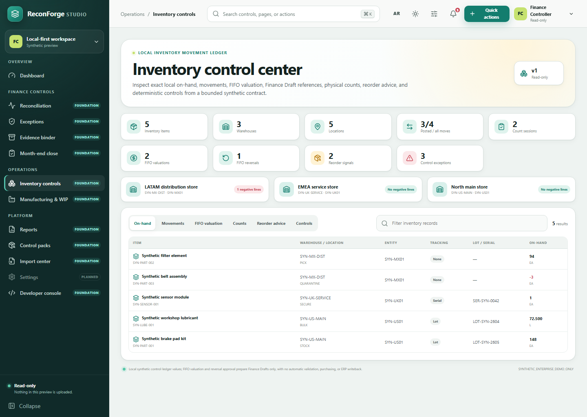
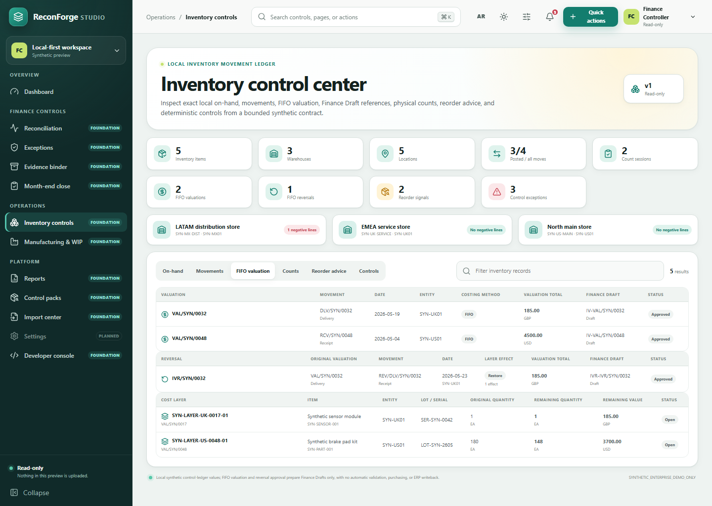
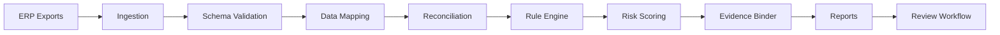

# ReconForge ERP

<p align="center">
  
</p>

<p align="center">
  
  
  
  
  
  <a href="https://www.bestpractices.dev/projects/13089"></a>
  
</p>

<p align="center">
  <a href="#visual-preview">Visual Preview</a> ·
  <a href="DEMO.md">Expert Showcase</a> ·
  <a href="#quick-start">Quick Start</a> ·
  <a href="#project-status">Project Status</a> ·
  <a href="#10-minute-demo">10-Minute Demo</a> ·
  <a href="#cli-examples">CLI Examples</a> ·
  <a href="#control-packs">Control Packs</a> ·
  <a href="#documentation">Documentation</a>
</p>

**ReconForge ERP is an open-source ERP reconciliation and finance controls toolkit for local-first stock-to-GL matching, work-order controls, WIP review, export-based ERP profiles, and evidence-ready reporting.**

It gives finance, inventory, workshop, ERP, and audit teams a repeatable way to inspect export-based operational controls without uploading sensitive ERP data to a third-party service.

## What It Does

- Reconciles stock movements against GL postings with configurable matching strategies.
- Reviews work orders, WIP, invoices, purchase flows, old-part returns, and workshop control gaps.
- Runs YAML control packs for audit rules, risk scoring, exception explanations, and evidence preparation.
- Helps inspect Odoo/SAP-style export mappings before users edit YAML profiles.
- Tracks local exception review status and compares generated outputs across periods.
- Adds local close checklist, variance analysis, control matrix, and preparer/reviewer workflow metadata foundations.
- Provides DB-backed foundations for broader local finance and inventory-control workflows, local API/Studio use, and backup/import/export support.
- Produces local artifacts: Excel management packs, HTML reports, Markdown summaries, CSV/JSON exports, and evidence binder folders.

## Why It Matters

ERP systems hold the source transactions, but month-end reconciliation often still happens in spreadsheets. ReconForge ERP makes those checks repeatable, inspectable, local, and audit-friendly for teams that need operational controls without a heavy enterprise close platform.

## Project Status

- Current release: **v0.7.0 - Foundation-Stage Local Platform Readiness**.
- ReconForge has expanded local-first finance controls platform foundations while remaining early-stage and conservative about readiness claims.
- Pilot-ready open-source toolkit for local evaluation and controlled pilots.
- Local-first and export-based; core workflows do not require cloud upload or paid APIs.
- No direct ERP connectors are claimed.
- Local users/RBAC, REST API, Studio auth-required mode, DB-backed workflows, and backup/import/export support are foundations, not a production identity, compliance, assurance, or hosted platform claim.
- The new React-based Studio under `apps/web` is an experimental, read-only, synthetic-data preview. It does not replace the current Studio or imply that planned ERP transaction modules are implemented.
- Docker build workflow support exists. Docker runtime verification remains a roadmap/release-gate item unless the documented build and run commands pass in a live Docker environment.

## New Platform Direction (Experimental)

ReconForge is evolving additively from a focused reconciliation toolkit toward a modular local ERP finance-controls platform. The current CLI, export workflows, local API, SQLite services, generated reports, evidence outputs, and server-rendered Studio remain supported while new capabilities are introduced in small tested slices.

The modern Studio foundation includes an original responsive dashboard shell, native exception, evidence, and inventory-control pages, command palette, mobile navigation, theme/density/accessibility preferences, English/Arabic direction support, and charts/tables generated from the existing synthetic enterprise demo.

| Layer | Current status |
| --- | --- |
| Reconciliation, rule packs, reports, evidence, review workflows | Implemented local-first workflows |
| SQLite finance and inventory-control ledgers, API, RBAC, audit events, current Studio | Foundation-stage services |
| Modern React Studio dashboard, exception queue, evidence binder, and inventory control center | Experimental read-only synthetic preview |
| Inventory counts and reorder advice | Experimental local foundation; no automatic posting, purchasing, or ERP writeback |
| FIFO inventory valuation, exact reversal, and Finance Core Draft bridge | Experimental local foundation; no automatic validation, partial/chained reversal, AVCO, landed cost, or ERP writeback |
| Full purchasing, sales, manufacturing, projects, HR, and POS transaction modules | Planned; not released behavior |

Generate the cohesive executive showcase and strict Studio bundle locally:

```bash
npm --prefix apps/web install
make showcase-serve
```

The [showcase guide](DEMO.md) provides a five-minute presenter path, non-Make commands, generated-artifact map, and evidence for each demo claim.

See the [repository audit](docs/analysis/repository-audit.md), [platform architecture](docs/architecture/platform-architecture.md), [global feature backlog](docs/product/global-feature-backlog.md), and [platform direction ADR](docs/adr/0001-platform-direction.md).

## Core Capabilities

| Area | What ReconForge ERP provides |
| --- | --- |
| Reconciliation | Stock-to-GL matching, amount/date variance checks, unmatched stock and unmatched GL review |
| Workshop controls | Work-order cost review, WIP aging, direct purchase fitting risk, old-part return checks |
| Audit intelligence | Risk scores, risk levels, suggested audit notes, control explanations, evidence binders |
| Rule packs | 19 domain control packs with YAML rules, mappings, expected exceptions, and risk models |
| Reporting | Excel management pack, executive HTML report, static dashboard, Markdown, CSV, and JSON outputs |
| Mapping | Odoo, SAP, ERPNext, Dynamics, NetSuite, and Oracle export mapping validation plus local header inspection and generic profile-template reports |
| Review workflow | Studio review actions, local review state, review register export, and status filtering |
| Period comparison | New, recurring, resolved, escalated, accepted-risk, and trend comparison |
| Close workflow | Local JSON close checklist, task statuses, owners as plain text, and close report exports |
| DB-backed foundations | Local account reconciliation, close, approval metadata, evidence registry, journal control, intercompany, control testing, matching, exception, metric, API, Studio, and backup foundations |
| Variance analysis | Local current-vs-previous summary comparison with amount variance, percentage variance, and threshold flags |
| Control matrix | Rule-pack-derived control matrix exports with owner and frequency placeholders |
| Handoff | Local client handoff pack with privacy note, redaction controls, and optional checksums |
| Data safety | Local-first processing, anonymized demo data support, evidence integrity manifests, and no API key required for core workflows |

## DB-Backed Platform Foundations

The merged foundation layer adds local SQLite-backed records and services for broader finance control workflows without changing the local-first/export-based model:

| Foundation area | Current scope |
| --- | --- |
| Account reconciliations | Account, balance, item, lifecycle, and audit-event foundations |
| Close management | Local close periods, tasks, dependencies, checklist state, and DB-backed workflow foundations |
| Approvals and certification metadata | Preparer/reviewer/certification metadata as workflow support only |
| Evidence registry | Local evidence references, lineage, checksum/provenance aids, and registry records |
| Journal controls | Journal control records and review metadata foundations |
| Intercompany | Local intercompany case, matching, imbalance, and settlement metadata foundations |
| Controls testing | Control test plans, samples, findings, remediation, and evidence linkage foundations |
| Matching | Deterministic matching job, candidate, decision, tolerance, and explainability foundations |
| Unified exceptions | Cross-workflow exception queue, ownership, status, risk, and aging foundations |
| Metrics | Local dashboard and lineage metric foundations |
| Local platform services | REST API, Studio DB pages, local users/RBAC, audit events, DB import/export, and backup bridge foundations |
| Runtime capability registry | Deterministic module IDs, maturity/capability labels, dependency and migration validation, permissions, interfaces, contracts, and test-evidence metadata |
| Organization master data | Workspace-scoped organization, legal-entity, branch, currency-reference, and non-overlapping fiscal-period foundations with RBAC, audit events, CLI/API, and a versioned path-free snapshot |
| Finance core control ledger | Hierarchical chart accounts, analytic dimensions, journal definitions, exact minor-unit balanced entries, SoD validation, immutable validated lines, and trial-balance contracts; no source-ERP posting |
| Inventory core movement ledger | Units, items, warehouse/location hierarchy, lot/serial references, exact-quantity Draft/Posted/Voided movements, derived on-hand and deterministic exceptions; no costing, fulfillment, or source-ERP writeback |
| Inventory planning controls | Immutable location-count snapshots, exact results, independent approval, Draft variance adjustments, and deterministic reorder advice; no purchase-order creation, valuation, finance posting, or source-ERP writeback |
| FIFO inventory valuation | Exact inbound costs, chronological FIFO layers/consumptions, immutable Approved evidence, exact whole-valuation reversal through a separately Posted mirror movement, SoD, and balanced Finance Core Draft bridges; no automatic validation, partial/chained reversal, AVCO, landed cost, manufacturing costing, or source-ERP writeback |

## Visual Preview

The screenshots below are generated from real local ReconForge outputs in this repository, not mockups or stock images.

### Modern Studio Foundation



Captured from the real `apps/web` client using versioned synthetic contracts generated by `reconforge demo showcase`. The dashboard leads with a deterministic decision brief, close-readiness signal, guided control story, domain health, and multi-entity risk concentration. This is a read-only experimental preview; existing mutation workflows remain in the current local Studio.

### Modern Exception Queue



The native queue renders deterministic exception IDs and supports local search plus risk, status, and source filters. Values come from the bounded `studio-exceptions.json` contract.

### Modern Evidence Binder



The native binder displays allowlisted evidence metadata and SHA-256 integrity aids from `studio-evidence.json`; local source paths are deliberately excluded from the browser contract.

### Modern Inventory Control Center



The native inventory page displays exact synthetic on-hand quantities, warehouses, movements, count sessions, reorder advice, FIFO valuation and reversal documents, cost layers, Finance Draft references, and deterministic control exceptions from `studio-inventory.json`. It is read-only; reorder signals create no purchasing documents, and valuation/reversal rows cannot approve workflows, validate accounting entries, or write to a source ERP.

### Modern FIFO Valuation View



The valuation tab renders bounded synthetic FIFO and exact-reversal summaries and explicitly labels generated accounting references as Draft. It does not imply browser-side approval, automatic ledger validation, partial reversal, supplier costing, landed cost, manufacturing costing, or source-ERP posting.

### Dashboard


Captured from `output/dashboard.html`, showing executive metrics, top exceptions, and WIP aging.

### Executive HTML Report


Captured from `output/executive_report.html`, generated from the same local management-pack workflow.

### Evidence Binder


Captured from `output/evidence/index.html`, listing high and critical exception cases.

### Management Pack Workbook


Rendered from the real `output/management_pack.xlsx` workbook contents.

## Quick Start

```bash
python -m venv .venv
source .venv/bin/activate
pip install -e ".[dev]"

reconforge doctor
reconforge validate examples/sample_data
reconforge report management-pack --input examples/sample_data --config config/reconforge.yml --output output
```

Open the generated local artifacts:

- `output/management_pack.xlsx`
- `output/executive_report.html`
- `output/dashboard.html`
- `output/summary.md`

## 10-Minute Demo

Run the complete first-time-user workflow:

```bash
reconforge demo run --output output/demo
```

Then open:

- `output/demo/executive_report.html`
- `output/demo/management_pack.xlsx`
- `output/demo/review_register.xlsx`
- `output/demo/evidence/index.html`
- `output/demo/client_pack/handoff_summary.md`

Start Studio and update review status locally:

```bash
reconforge studio --input examples/sample_data --output output/demo
```

In Studio, open **Exceptions**, update an exception such as `EXC-0001`, filter by review status, then export or review `output/demo/review_register.xlsx`.

Generate a synthetic enterprise-style platform demo package:

```bash
reconforge demo enterprise --output output/enterprise_demo
reconforge demo enterprise --output output/enterprise_demo --db output/enterprise_demo/reconforge.db
```

The enterprise demo uses synthetic data only. It includes no real customers, no fake ROI, no fake logos, no testimonials, no compliance certification, no audit opinion, and no direct ERP connector claim.

## CLI Examples

```bash
reconforge demo run --output output/demo
reconforge demo enterprise --output output/enterprise_demo

reconforge reconcile stock-gl --input examples/sample_data --config config/reconforge.yml --output output
reconforge reconcile stock-gl --input examples/sample_data --config config/reconforge.yml --output output --matching-strategy audit-safe
reconforge reconcile workorders --input examples/sample_data --config config/reconforge.yml --output output

reconforge mappings validate --pack control-packs/odoo-inventory-valuation
reconforge mappings validate --pack control-packs/sap-mb51-fagll03
reconforge mappings validate --pack control-packs/erpnext-stock-gl
reconforge mappings validate --pack control-packs/dynamics-inventory-gl
reconforge mappings validate --pack control-packs/netsuite-inventory-gl
reconforge mappings validate --pack control-packs/oracle-inventory-gl
reconforge mappings wizard --input examples/sample_data --pack control-packs/odoo-inventory-valuation --output output/mapping_wizard
reconforge mappings profile-template --output output/profile_template
reconforge rules validate --pack control-packs/audit-basic
reconforge rules list --pack control-packs/audit-basic
reconforge rules explain --pack control-packs/audit-basic --rule AB-001
reconforge rules run --input examples/sample_data --pack control-packs/audit-basic --output output/rules

reconforge report management-pack --input examples/sample_data --config config/reconforge.yml --output output
reconforge report evidence-binder --input output --output output/evidence
reconforge report client-pack --input output --output output/client_pack
reconforge report client-pack --input output --output output/client_pack_redacted --redact-names --redact-amounts --exclude-raw-records --include-manifest-checksums
reconforge compare periods --inputs output/demo output/demo --output output/period_comparison
reconforge close init --output output/close
reconforge close set-status --input output/close --task-id CLOSE-001 --status Complete --owner "Finance Controller" --note "Reviewed"
reconforge close report --input output/close --output output/close_report
reconforge analyze variance --current output/feb --previous output/jan --output output/variance
reconforge controls matrix --pack control-packs/audit-basic --output output/control_matrix
reconforge explain exception --input output/management_pack.json --exception-id EXC-0001

reconforge anonymize --input examples/sample_data --output examples/anonymized_data --profile public-demo --amount-noise-percent 5
reconforge generate synthetic --rows 1000 --industry workshop --currency SAR --output benchmarks/small_1k
reconforge benchmark --input benchmarks/small_1k --engine pandas --output output/benchmark
reconforge studio --input examples/sample_data --output output
```

## ERP Mapping Profiles

ReconForge ERP includes export-based mapping profiles for Odoo inventory valuation, SAP MB51/FAGLL03, ERPNext, Microsoft Dynamics, and NetSuite workflows. These profiles help users map local CSV/XLSX exports into the canonical ReconForge files before running stock-to-GL reconciliation, rules, reports, and evidence binder workflows.

- `control-packs/odoo-inventory-valuation` covers Odoo stock moves, stock valuation layers, account move lines, products, work-order references, and invoices where available.
- `control-packs/sap-mb51-fagll03` covers SAP MB51 material documents and FAGLL03/FBL3N G/L line item exports.
- `control-packs/erpnext-stock-gl` covers ERPNext stock ledger, GL entry, and item exports.
- `control-packs/dynamics-inventory-gl` covers Microsoft Dynamics inventory transactions, voucher/GL rows, and released products.
- `control-packs/netsuite-inventory-gl` covers NetSuite inventory activity, GL impact/accounting lines, and item saved searches.
- `control-packs/oracle-inventory-gl` covers Oracle-style inventory transaction, subledger accounting, general ledger, and item master exports.
- Core workflows are local-first and do not require cloud upload or direct ERP connectors.
- Use `reconforge mappings wizard` to inspect CSV/XLSX headers and generate `mapping_report.md` plus `mapping_report.json`.
- Use `reconforge mappings profile-template` to generate a local mapping template and profile authoring guide for generic CSV exports.

## Local Review Workflow

ReconForge can track exception review state in `output/review_state.json` without a database or cloud service. Use Studio or `reconforge review list`, `reconforge review set-status`, and `reconforge review export` to assign local statuses, reviewer notes, decision reasons, escalation owners, and an Excel review register.

## Multi-Period Comparison

Compare generated output folders to identify new, recurring, resolved, escalated, and accepted-risk items:

```bash
reconforge compare periods --inputs output/jan output/feb --output output/period_comparison
```

The command writes Excel, HTML, JSON, and Markdown outputs. It does not infer savings.

## Report Outputs

| Output | Purpose |
| --- | --- |
| `management_pack.xlsx` | Executive pack, reconciliation summary, risk matrix, exceptions, WIP, audit log, and configuration |
| `executive_report.html` | Local executive HTML report with Control Value Summary |
| `dashboard.html` | Static local dashboard |
| `output/evidence/` | Audit case folders for High and Critical exceptions |
| `output/evidence/evidence_manifest.json` | SHA-256 integrity manifest for generated evidence artifacts |
| `output/review_state.json` | Local exception review status, reviewer notes, and decision metadata |
| `output/review_register.xlsx` | Optional review register exported from local review state |
| `output/close/close_checklist.json` | Local close checklist task state |
| `output/close_report/` | Close checklist HTML, Excel, CSV, JSON, and Markdown reports |
| `output/variance/` | Local variance analysis workbook, CSV, JSON, HTML, and Markdown outputs |
| `output/control_matrix/` | Rule-pack-derived control matrix workbook, CSV, JSON, and Markdown outputs |
| `output/rules/` | Rule engine CSV/JSON outputs |
| `output/benchmark/` | Runtime and match-rate benchmark outputs |
| `output/client_pack/` | Local handoff folder with summary, next steps, privacy note, redaction settings, and manifest |
| `output/enterprise_demo/` | Synthetic multi-entity platform demo package with local files, reports, manifest, walkthrough, and optional SQLite DB |

## Who It Is For

- Finance controllers and accountants.
- Internal and external auditors.
- ERP consultants and implementation partners.
- Odoo implementers and SAP users working from exports.
- Inventory, stores, spare-parts, workshop, fleet, dealership, service, and manufacturing teams.

## Architecture



See [docs/architecture.md](docs/architecture.md) for system, pipeline, rule engine, evidence, control pack, local deployment, and future open-core diagrams.

## Control Packs

ReconForge ERP ships 18 control packs:

- `audit-basic`
- `odoo-inventory-valuation`
- `sap-mb51-fagll03`
- `erpnext-stock-gl`
- `dynamics-inventory-gl`
- `netsuite-inventory-gl`
- `workshop-spare-parts`
- `fleet-maintenance`
- `manufacturing-wip`
- `dealership-service`
- `service-contracts`
- `purchase-to-pay`
- `inventory-valuation`
- `month-end-close`
- `fixed-assets-spares`
- `multi-warehouse-controls`
- `high-risk-transactions`
- `fraud-red-flags`

Each pack includes metadata, rules, mapping guidance, risk model, README, expected exceptions, and a sample command.

## Evidence Binder

For High and Critical exceptions, the binder creates review-ready case folders:

```text
output/evidence/EXC-0001/
├── summary.md
├── source_records.csv
├── match_candidates.csv
├── triggered_rules.yml
├── recommended_action.md
├── review_form.md
└── audit_trail.json
```

The binder also writes `index.html`, `evidence_index.json`, `evidence_register.xlsx`, and `evidence_manifest.json`.

## Security And Quality

ReconForge ERP processes local files by default. It does not upload ERP exports, does not require paid APIs, and does not require AI services for core functionality. Use the anonymizer before sharing data.

Quality and security checks are part of the repository workflow:

- CI runs Ruff, mypy, pytest, CLI smoke checks, and package build.
- CodeQL analyzes Python on pull requests and scheduled runs.
- Security workflow runs Bandit and `pip-audit`.
- OpenSSF Scorecard runs on `main`/`master` pushes, schedule, and manual dispatch as a repository security maturity check, not a guarantee.
- SBOM workflow generates a CycloneDX Python dependency artifact on release tags/manual dispatch.
- Path-serving routes use registry-based download allowlists instead of constructing filesystem paths from route parameters.

See [SECURITY.md](SECURITY.md), [docs/security-model.md](docs/security-model.md), [docs/security-whitepaper.md](docs/security-whitepaper.md), [docs/redaction-controls.md](docs/redaction-controls.md), [docs/evidence-integrity.md](docs/evidence-integrity.md), [docs/data-privacy.md](docs/data-privacy.md), and [docs/compliance-disclaimer.md](docs/compliance-disclaimer.md).

## Documentation

- [Getting started](docs/getting-started.md)
- [10-minute demo scenarios](docs/demo-scenarios.md)
- [Architecture](docs/architecture.md)
- [Reconciliation methodology](docs/reconciliation-methodology.md)
- [Controls and audit](docs/controls-and-audit.md)
- [Rule-pack schema reference](docs/rule-pack-schema-reference.md)
- [Review workflow](docs/review-workflow.md)
- [Workflow state machine foundation](docs/workflow-state-machine.md)
- [Local REST API](docs/api.md)
- [DB import/export bridge](docs/db-import-export.md)
- [DB-backed finance workflows](docs/db-finance-workflows.md)
- [Inventory core movement ledger](docs/inventory-core.md)
- [Inventory counts and reorder signals](docs/inventory-planning.md)
- [FIFO inventory valuation foundation](docs/inventory-valuation.md)
- [Matching, exceptions, and metrics](docs/matching-exceptions-metrics.md)
- [Close workflow](docs/close-workflow.md)
- [Variance analysis](docs/variance-analysis.md)
- [Control matrix](docs/control-matrix.md)
- [Reconciliation certification metadata](docs/reconciliation-certification.md)
- [ReconForge Studio](docs/reconforge-studio.md)
- [Mapping wizard](docs/mapping-wizard.md)
- [ERP export profiles](docs/erp-export-profiles.md)
- [Multi-period comparison](docs/multi-period-comparison.md)
- [Client handoff pack](docs/client-handoff-pack.md)
- [Redaction controls](docs/redaction-controls.md)
- [Evidence integrity](docs/evidence-integrity.md)
- [Docker deployment](docs/docker-deployment.md)
- [Deployment smoke check](docs/deployment-smoke-check.md)
- [Docker verification](docs/docker-verification.md)
- [Docker verification report](docs/strategy/docker-verification-report.md)
- [Security whitepaper](docs/security-whitepaper.md)
- [Security model](docs/security-model.md)
- [Local users and RBAC](docs/security/local-users-rbac.md)
- [Local auth and RBAC](docs/security/local-auth-rbac.md)
- [Security questionnaire](docs/security/security-questionnaire.md)
- [Security limitations](docs/security/limitations.md)
- [Compliance disclaimer](docs/compliance-disclaimer.md)
- [OSS ecosystem importance](docs/strategy/oss-ecosystem-importance.md)
- [Demo output pack](docs/demo-output-pack.md)
- [Synthetic enterprise demo](docs/synthetic-enterprise-demo.md)
- [Pilot onboarding checklist](docs/pilot-onboarding-checklist.md)
- [Buyer FAQ](docs/buyer-faq.md)
- [Implementation packages](docs/implementation-packages.md)
- [Support playbook](docs/support-playbook.md)
- [Release readiness checklist](docs/release-readiness-checklist.md)
- [v0.7.0 release notes](docs/releases/v0.7.0.md)
- [Website and launch copy package](docs/website/github-launch-post.md)
- [Claim boundary guide](docs/website/claim-boundary-guide.md)
- [Synthetic case study](docs/case-studies/workshop-spare-parts-health-check.md)
- [Odoo synthetic case study](docs/case-studies/odoo-stock-valuation-pilot.md)
- [SAP synthetic case study](docs/case-studies/sap-export-reconciliation-pilot.md)
- [Pricing and services](docs/commercial/pricing-and-services.md)
- [Pilot proposal template](docs/commercial/pilot-proposal-template.md)
- [Client onboarding checklist](docs/commercial/client-onboarding-checklist.md)
- [Demo video script](docs/demo-video-script.md)
- [Demo recording checklist](docs/demo-recording-checklist.md)
- [Risk scoring](docs/risk-scoring.md)
- [Report samples](docs/report-samples.md)
- [Anonymization](docs/anonymization.md)
- [Synthetic data](docs/synthetic-data.md)
- [Benchmarking](docs/benchmark.md)
- [Plugin development](docs/plugin-development.md)
- [AI assistant architecture](docs/ai-assistant.md)
- [AI maintainer instructions](AGENTS.md)
- [Release process](docs/maintainers/release-process.md)
- [Suggested issues](docs/maintainers/suggested-issues.md)
- [Discussions starter kit](docs/maintainers/discussions-starter-kit.md)
- [Odoo export guide](docs/odoo-export-guide.md)
- [SAP export guide](docs/sap-export-guide.md)
- [Plain-English guide](docs/plain-english-guide.md)
- [Arabic guide](docs/ar/guide.md)
- [Playbooks](docs/playbooks/)

## Docker

```bash
docker build -t reconforge-erp .
docker run --rm -v ${PWD}/output:/app/output reconforge-erp reconforge doctor
docker run --rm -v ${PWD}/output:/app/output reconforge-erp reconforge demo run --output output/demo
```

## Quality Checks

```bash
python -m ruff check .
python -m mypy reconforge
python -m pytest
python -m bandit -q -r reconforge
```

## Roadmap

Near-term work: deeper workflow depth, richer Studio actions, website refresh, deployment smoke automation beyond the documented smoke checklist, observability depth, and optional future design work for real SSO/SCIM and direct ERP connectors.

## Contributing

Contributions are welcome from engineers, ERP consultants, accountants, auditors, and operations teams. Useful contributions include rule packs, export profiles, anonymized scenarios, tests, documentation, and report improvements. See [CONTRIBUTING.md](CONTRIBUTING.md), [AGENTS.md](AGENTS.md), [docs/maintainers/release-process.md](docs/maintainers/release-process.md), and [docs/maintainers/suggested-issues.md](docs/maintainers/suggested-issues.md).

## License

MIT License.
