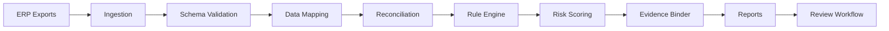

# ReconForge ERP

```text
┌─────────────────────────────────────────────┐
│                ReconForge ERP               │
│  Open ERP Reconciliation & Audit Intelligence│
└─────────────────────────────────────────────┘
```


**Open-source ERP reconciliation and audit intelligence for stock-to-GL matching, work orders, WIP, Odoo/SAP exports, and local-first control reporting.**

ReconForge ERP is the open-source audit layer missing between inventory operations and financial accounting. It helps finance, inventory, workshop, audit, and ERP teams reconcile stock movements, GL postings, work orders, WIP, invoices, purchase flows, old-part returns, and operational controls from Odoo, SAP-style exports, and generic ERP CSV/Excel data.

## Maturity Note

ReconForge ERP is early-stage. It is designed for local-first ERP reconciliation and audit workflows and currently focuses on export-based workflows for Odoo, SAP-style reports, and generic ERP datasets. v0.3.0 is a serious pre-1.0 platform release, not a claim of broad production adoption.

## Why Existing Workflows Fail

ERP systems hold the source transactions, but month-end reconciliation often happens in spreadsheets. Enterprise close platforms are mature, but many companies cannot justify the cost, implementation effort, or cloud-upload model for operational stock/WIP controls. ReconForge ERP makes these checks repeatable, inspectable, local, and audit-friendly.

## Who It Is For

- Finance controllers and accountants.
- Internal and external auditors.
- ERP consultants and implementation partners.
- Odoo implementers and SAP users.
- Inventory, stores, and spare-parts managers.
- Workshop, fleet, dealership, service, and manufacturing teams.

## Core Features

- Typer CLI for validation, reconciliation, rules, reports, evidence, anonymization, generation, benchmark, dashboard, and Studio.
- Stock-to-GL matching with standard, strict, aggressive, and audit-safe strategies.
- Work-order controls for spare parts, WIP, invoices, direct purchase fitting, old-part returns, and cancelled PO linkage.
- Advanced YAML rule engine with row-level and cross-file operators.
- Fifteen domain control packs.
- Risk intelligence engine with score, level, explanation, escalation, and suggested audit note.
- Audit evidence binder with case folders, review forms, HTML index, and Excel register.
- Data anonymizer with referential integrity and safe-sharing profiles.
- Synthetic data lab for workshop, manufacturing, fleet, dealership, and service examples.
- Benchmark engine with Pandas, optional DuckDB, and HTML/JSON/CSV/Markdown outputs.
- ReconForge Studio local web interface.
- Plugin/connector foundation for future Odoo, SAP, ERPNext, NetSuite, and Dynamics adapters.
- AI-ready offline explanation layer; no API key required for core functionality.

## Architecture



See [docs/architecture.md](docs/architecture.md) for system, pipeline, rule engine, evidence, control pack, local deployment, and future open-core diagrams.

## Quick Start

```bash
python -m venv .venv
source .venv/bin/activate
pip install -e ".[dev]"

reconforge doctor
reconforge validate examples/sample_data
reconforge report management-pack --input examples/sample_data --config config/reconforge.yml --output output
```

Open:

- `output/management_pack.xlsx`
- `output/executive_report.html`
- `output/dashboard.html`
- `output/summary.md`

## Demo Workflow

```bash
reconforge reconcile stock-gl --input examples/sample_data --config config/reconforge.yml --output output
reconforge reconcile stock-gl --input examples/sample_data --config config/reconforge.yml --output output --matching-strategy audit-safe
reconforge reconcile workorders --input examples/sample_data --config config/reconforge.yml --output output
reconforge rules validate --pack control-packs/audit-basic
reconforge rules list --pack control-packs/audit-basic
reconforge rules explain --pack control-packs/audit-basic --rule AB-001
reconforge rules run --input examples/sample_data --pack control-packs/audit-basic --output output/rules
reconforge report evidence-binder --input output --output output/evidence
reconforge anonymize --input examples/sample_data --output examples/anonymized_data --profile public-demo --amount-noise-percent 5
reconforge generate synthetic --rows 1000 --industry workshop --currency SAR --output benchmarks/small_1k
reconforge benchmark --input benchmarks/small_1k --engine pandas --output output/benchmark
reconforge explain exception --input output/management_pack.json --exception-id EXC-0001
reconforge studio --input examples/sample_data --output output
```

## Report Preview

| Output | Purpose |
| --- | --- |
| `management_pack.xlsx` | Executive pack, reconciliation summary, risk matrix, exceptions, WIP, audit log, configuration |
| `executive_report.html` | Local executive HTML report |
| `dashboard.html` | Static local dashboard |
| `output/evidence/` | Audit case folders for High/Critical exceptions |
| `output/rules/` | Rule engine CSV/JSON outputs |
| `output/benchmark/` | Runtime and match-rate benchmark outputs |

## Control Packs

ReconForge ERP ships 15 control packs:

- `audit-basic`
- `odoo-inventory-valuation`
- `sap-mb51-fagll03`
- `workshop-spare-parts`
- `fleet-maintenance`
- `manufacturing-wip`
- `dealership-service`
- `service-contracts`
- `purchase-to-pay`
- `inventory-valuation`
- `month-end-close`
- `fixed-assets-spares`
- `multi-warehouse-controls`
- `high-risk-transactions`
- `fraud-red-flags`

Each pack includes metadata, rules, mapping guidance, risk model, README, expected exceptions, and sample command.

## Evidence Binder

For High/Critical exceptions:

```text
output/evidence/EXC-0001/
├── summary.md
├── source_records.csv
├── match_candidates.csv
├── triggered_rules.yml
├── recommended_action.md
├── review_form.md
└── audit_trail.json
```

The binder also writes `index.html` and `evidence_register.xlsx`.

## Security and Local-First

ReconForge ERP processes local files by default. It does not upload ERP exports, does not require paid APIs, and does not require AI services. Use the anonymizer before sharing data. See [SECURITY.md](SECURITY.md), [docs/security-model.md](docs/security-model.md), and [docs/data-privacy.md](docs/data-privacy.md).

## Documentation Map

- [Market intelligence](docs/market-intelligence.md)
- [Category strategy](docs/category-strategy.md)
- [Architecture](docs/architecture.md)
- [Risk scoring](docs/risk-scoring.md)
- [Anonymization](docs/anonymization.md)
- [Synthetic data](docs/synthetic-data.md)
- [Benchmarking](docs/benchmark.md)
- [ReconForge Studio](docs/reconforge-studio.md)
- [Plugin development](docs/plugin-development.md)
- [AI assistant architecture](docs/ai-assistant.md)
- [Plain-English guide](docs/plain-english-guide.md)
- [Arabic guide](docs/ar/guide.md)
- [Playbooks](docs/playbooks/)
- [Commercial strategy](docs/commercial-strategy.md)
- [OpenAI OSS application pack](docs/openai-oss-application.md)

## Docker

```bash
docker build -t reconforge-erp .
docker run --rm -v $(pwd)/output:/app/output reconforge-erp reconforge doctor
```

## Quality Checks

```bash
ruff check .
mypy reconforge
pytest
```

## Roadmap

Near-term work: Odoo/SAP mapping profiles, exception review lifecycle, recurring-period comparison, richer Studio filters, ERPNext/NetSuite/Dynamics CSV adapters, and self-hosted review workflow experiments.

## Contributing

Contributions are welcome from engineers, ERP consultants, accountants, auditors, and operations teams. Useful contributions include rule packs, mapping templates, anonymized scenarios, tests, documentation, and report improvements. See [CONTRIBUTING.md](CONTRIBUTING.md).

## License

MIT License.
