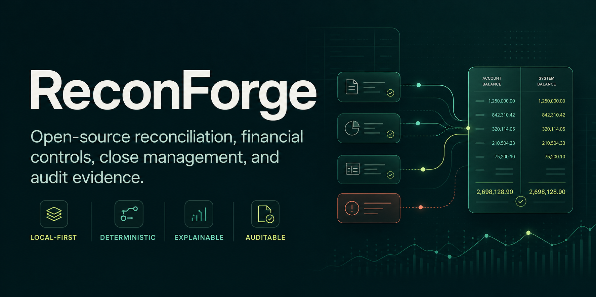
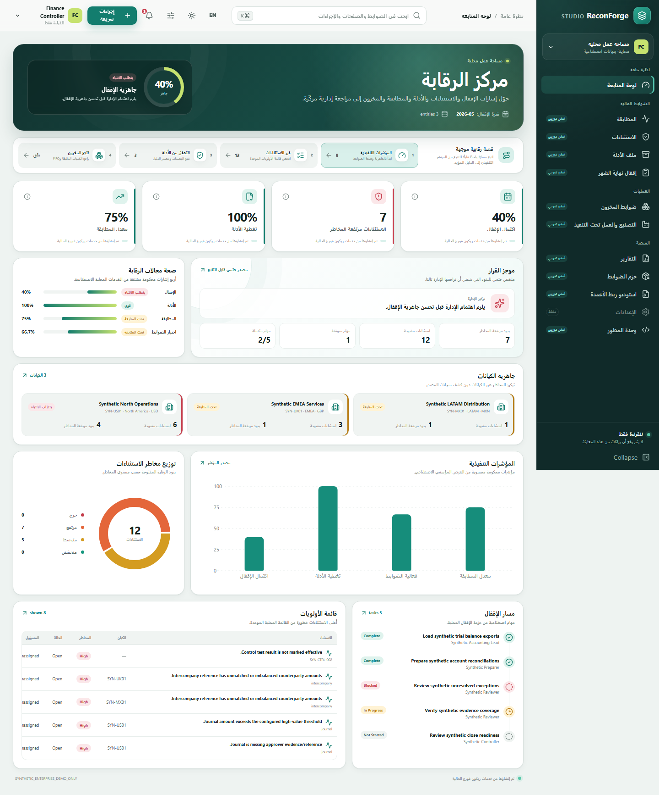
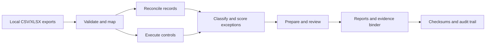

<p align="center">
  
</p>

<p align="center">
  <strong>Open-Source Financial Reconciliation, Integrity Controls, Close Management, and Audit Evidence Platform</strong>
</p>

<p align="center">
  <a href="https://github.com/amrzainmubarak/reconforge-erp/actions/workflows/ci.yml"></a>
  <a href="https://github.com/amrzainmubarak/reconforge-erp/actions/workflows/security.yml"></a>
  
  
  <a href="https://www.bestpractices.dev/projects/13089"></a>
  <a href="LICENSE"></a>
</p>

<p align="center">
  <a href="#the-platform">Platform</a> ·
  <a href="#product-tour">Product tour</a> ·
  <a href="#quick-start">Quick start</a> ·
  <a href="#architecture">Architecture</a> ·
  <a href="docs/showcase.md">Live showcase</a> ·
  <a href="#project-maturity">Project maturity</a> ·
  <a href="#documentation">Documentation</a>
</p>

ReconForge works beside ERP, accounting, inventory, banking, payroll, commerce, and operational systems. It turns local exports into deterministic reconciliations, governed exception workflows, control results, management reporting, and verifiable evidence—without making a third-party cloud service part of the core workflow.

It is deliberately positioned as a **finance-controls platform**, not a replacement ERP. The project prioritizes financial correctness, reproducibility, explainability, and honest capability boundaries over opaque automation.

> [!IMPORTANT]
> ReconForge is an alpha-stage, local-first toolkit for evaluation and controlled pilots. It does not issue audit opinions, provide compliance certification, or write transactions back to a source ERP.

## The platform

| Reconcile | Control | Investigate | Prove |
| --- | --- | --- | --- |
| Match operational and financial records with deterministic policies, stable identifiers, tolerances, and traceable candidate decisions. | Run versioned YAML control packs across inventory, GL, WIP, close, journals, intercompany, and data-quality scenarios. | Prioritize exceptions by risk, ownership, age, and status; retain review decisions and manual rationale. | Generate Excel/HTML reports, evidence case folders, provenance records, and SHA-256 integrity manifests locally. |

### Why teams use ReconForge

- **Local by default.** Core reconciliation, review, reporting, and evidence workflows run against files and local state under the operator's control.
- **Determinism as a release gate.** Matching is designed around stable ordering and explainable decision data; any input-order or engine variance is treated as a blocking correctness defect, not hidden behind a success claim.
- **Finance-aware.** Invalid amounts remain visible as data-quality failures; unmatched records and exceptions are not silently discarded.
- **Evidence first.** Source lineage, generated artifacts, review metadata, audit events, and checksums are treated as product outputs.
- **Extensible without lock-in.** Mapping profiles, control packs, CLI commands, a local API, SQLite services, and documented schemas form the extension surface.

## Product tour

The views below are rendered by the real React Studio from versioned, synthetic ReconForge contracts. The modern Studio is currently a read-only experimental client; mutation workflows remain in the current local Studio and CLI.


<table>
  <tr>
    <td width="50%"></td>
    <td width="50%"></td>
  </tr>
  <tr>
    <td><strong>Exception operations</strong><br>Search and filter deterministic exception IDs by risk, status, source, and owner.</td>
    <td><strong>Evidence integrity</strong><br>Review allowlisted provenance, evidence metadata, and SHA-256 verification aids.</td>
  </tr>
  <tr>
    <td width="50%"></td>
    <td width="50%"></td>
  </tr>
  <tr>
    <td><strong>Inventory controls</strong><br>Inspect exact quantities, movements, counts, reorder signals, FIFO evidence, and control exceptions.</td>
    <td><strong>Accessible operations</strong><br>Responsive layouts, theme and density preferences, reduced motion, and English/Arabic direction support.</td>
  </tr>
</table>

## From source records to reviewable evidence



The same pipeline can be driven from the CLI, generated reports, the current local Studio, or DB-backed application services. Core execution does not require a paid API or external AI service.

## Capability map

| Domain | Implemented scope |
| --- | --- |
| Reconciliation | Stock-to-GL matching, amount/date/reference policies, unmatched-record visibility, stable-ID foundations, candidate explanations, and optional Pandas/experimental DuckDB execution subject to parity gates |
| Finance controls | Account-reconciliation, close, approval metadata, journal, intercompany, control-testing, variance, and unified-exception foundations |
| Inventory controls | Governed master data, movements, exact on-hand quantities, counts, reorder advice, FIFO valuation evidence, and exact whole-valuation reversal foundations |
| Accounts Payable | Foundation-stage suppliers, purchase orders, posted receipts, supplier invoices, deterministic three-way matching, exception routing, and local workflow approvals; no statutory posting or payments |
| Accounts Receivable | Foundation-stage customer credit profiles, exact invoices, approval-time credit controls, posted receipts, allocations, exposure, and aging; no statutory posting, tax, collections, or payments |
| Workflow | Local review state, DB-backed state transitions, role/permission checks, preparer/reviewer metadata, period lock/reopen foundations, and audit events |
| Evidence and reporting | Management workbook, executive HTML, Markdown/CSV/JSON exports, review register, evidence binder, redaction options, and checksum manifests |
| Interfaces | First-class Typer CLI, local FastAPI v1 foundation, server-rendered Studio, and experimental React Studio |
| Configuration | Nineteen tested control-pack directories plus export mapping profiles for Odoo, SAP, ERPNext, Dynamics, NetSuite, and Oracle-style files |
| Operations | SQLite migrations, backup/restore/verification, health diagnostics, synthetic data generation, benchmarks, Docker assets, and release checks |

Export profiles map user-supplied files into ReconForge's canonical model. They are not live vendor integrations or vendor endorsements.

## Quick start

### Requirements

- Python 3.11 or 3.12
- Git
- Node.js 22+ only when building the experimental React Studio

### Install and run the local demo

```bash
git clone https://github.com/amrzainmubarak/reconforge-erp.git
cd reconforge-erp

python -m venv .venv
```

Activate the environment:

```bash
# macOS / Linux
source .venv/bin/activate
```

```powershell
# Windows PowerShell
.\.venv\Scripts\Activate.ps1
```

Then install and run:

```bash
python -m pip install -e .

reconforge doctor
reconforge demo run --output output/demo
```

The demo uses repository sample data and writes local artifacts to `output/demo/`, including:

- `executive_report.html` — executive reconciliation and control summary;
- `management_pack.xlsx` — workbook for management and reviewer use;
- `review_register.xlsx` — exception decisions and workflow metadata;
- `evidence/index.html` — browsable evidence binder;
- `client_pack/handoff_summary.md` — local handoff summary and boundaries.

Start the current interactive Studio:

```bash
reconforge studio --input examples/sample_data --output output/demo
```

Run a reconciliation directly:

```bash
reconforge validate examples/sample_data
reconforge reconcile stock-gl \
  --input examples/sample_data \
  --config config/reconforge.yml \
  --output output/reconciliation
```

Windows PowerShell users can replace the line continuations with backticks or run the command on one line. See [Getting started](docs/getting-started.md) for workspace creation and input contracts.

### Build the modern Studio showcase

```bash
uv sync --locked --extra dev
npm --prefix apps/web ci
make showcase-serve
```

The repository's reproducible contributor path requires the exact uv version in
`pyproject.toml`; the simpler pip install above remains available for local
Community evaluation but is not dependency-lock evidence.

Open `http://127.0.0.1:4173`. The command regenerates synthetic enterprise artifacts, validates the bounded browser contracts, builds the application, and serves it on loopback. The [showcase guide](docs/showcase.md) includes the review boundary; [demo scenarios](docs/demo-scenarios.md) provide commands and review paths.

## Architecture

ReconForge preserves a file-first workflow while adding governed local platform services incrementally.

| Layer | Responsibility | Current implementation |
| --- | --- | --- |
| Interfaces | Human and machine entry points | Typer CLI, FastAPI v1, server-rendered Studio, experimental React client |
| Application services | Authorization, orchestration, transactions | Reconciliation, close, accounts, approvals, evidence, exceptions, matching, inventory, and operational services |
| Domain logic | Financial rules and invariants | Deterministic matching, controls, risk, workflow, exact inventory quantities, valuation evidence |
| Persistence | Local state and migrations | SQLite with explicit migrations, foreign keys, backup/restore, and repository boundaries |
| Artifacts | Portable review and evidence outputs | Versioned JSON, CSV, XLSX, HTML, Markdown, schemas, and checksum manifests |

```text
reconforge/     Python core, CLI, API, Studio, domain and platform services
apps/web/       Experimental React/Vite/TypeScript Studio
control-packs/  Versioned rules, mappings, risk models, and expected results
docs/schemas/   Public artifact and browser-contract schemas
examples/       Synthetic and anonymized finance datasets
tests/          Unit, integration, security, contract, and regression coverage
```

Read the [current-state architecture](docs/architecture/current-state.md), [target-state architecture](docs/architecture/target-state.md), [platform architecture](docs/architecture/platform-architecture.md), and [architecture decisions](docs/adr/0001-platform-direction.md).

## Control packs and mappings

ReconForge ships 19 control-pack directories covering audit basics, inventory valuation, purchase-to-pay, month-end close, fixed assets, warehouse controls, WIP, fleet/workshop/service operations, high-risk transactions, and fraud indicators.

```bash
reconforge rules validate --pack control-packs/audit-basic
reconforge rules explain --pack control-packs/audit-basic --rule AB-001
reconforge rules run \
  --input examples/sample_data \
  --pack control-packs/audit-basic \
  --output output/rules

reconforge mappings validate --pack control-packs/odoo-inventory-valuation
reconforge mappings wizard \
  --input examples/sample_data \
  --pack control-packs/odoo-inventory-valuation \
  --output output/mapping-wizard
```

Each pack contains metadata, mapping guidance, rules, a risk model, expected exceptions, documentation, and an executable sample command. Rules use bounded declarative operators; packs do not execute arbitrary Python.
Current CLI rule runs preserve exact decimal YAML lexemes and emit schema-v2 local result provenance (policy plus pack, input, decision, and artifact digests). These hashes detect content inconsistency; they are not signatures or source-system authenticity proof. Historical unversioned rule results remain readable as legacy artifacts.

## Evidence, trust, and data handling

ReconForge is designed for inspectable local operation, but deployment security remains the operator's responsibility.

- Financial source files stay on the configured machine unless the operator moves or shares them.
- Generated HTML escapes user-controlled fields, and download routes use registry-based allowlists.
- Local API and DB-backed workflows include authentication/RBAC foundations, throttling, CSRF protections in applicable Studio flows, and append-only audit events.
- Evidence packages can include file hashes, configuration and source metadata, review forms, source records, candidate decisions, and an integrity manifest.
- Public demos and repository fixtures use synthetic or anonymized records; live customer data should not be committed or shared in issues.

These controls aid review and tamper detection; they are not an assurance report, legal signature, or regulatory certification. Start with the [security architecture](docs/security/security-architecture.md), [threat model](docs/security/threat-model.md), [security policy](SECURITY.md), [evidence integrity guide](docs/evidence-integrity.md), and [data privacy guide](docs/data-privacy.md).

## Project maturity

The current version is **v0.7.0**, classified as alpha/foundation-stage software.

| Maturity | Scope |
| --- | --- |
| Implemented | Export validation and mapping, stock-to-GL and workshop reconciliation, deterministic control packs, risk/exceptions, local review state, reports/evidence, CLI, synthetic demos, and server-rendered Studio |
| Foundation-stage | SQLite-backed finance/inventory/AP/AR services, local users and RBAC, workflows, audit events, API routes, backup/import/export, module registry, and governed master data |
| Experimental | Read-only React Studio, inventory planning, FIFO valuation and exact reversal, Finance Core Draft bridge, and optional DuckDB analytical execution |
| Planned | Broader reconciliation templates, write-enabled modern Studio, remaining PostgreSQL/Redis/S3 server-profile integration, tenant propagation across all services, resumable large-data jobs, richer observability, and separately tested live connectors |
| Outside released scope | Complete ERP transaction processing, automatic source-system posting, hosted multi-tenant service, and formal audit/compliance assurance |

Implementation status is tracked in the [engineering audit](docs/engineering-audit.md), [repository audit](docs/analysis/repository-audit.md), [risk register](docs/risk-register.md), and [roadmap](docs/roadmap.md). Feature labels and screenshots are not evidence of production readiness; executable tests and release gates remain authoritative.

## Docker

```bash
docker build -t reconforge-erp .
docker run --rm reconforge-erp reconforge doctor
docker run --rm -v ${PWD}/output:/app/output reconforge-erp \
  reconforge demo run --output output/demo
```

Use the [Docker deployment guide](docs/docker-deployment.md), [deployment smoke check](docs/deployment-smoke-check.md), and [Docker verification guide](docs/docker-verification.md). Runtime verification depends on a working local Docker environment and should be treated as a release gate, not inferred from the presence of a Dockerfile.

## Quality gates

```bash
python -m ruff check .
python -m mypy reconforge
python -m pytest
python -m bandit -q -r reconforge
git diff --check
```

Repository automation defines linting, typing, tests, package/container builds, Bandit, a universal hash-bearing Python/server lock, npm lock audit, checksum-pinned full-history/tree secret scans, closed expiring exception policy, CodeQL, release-integrated per-subject CycloneDX SBOMs, and OpenSSF Scorecard. Local locked Python 3.11 and npm audits plus both secret scans pass; hosted Python 3.11/3.12 enforcement, container execution, image scanning, and signed release evidence do not yet exist. See the [supply-chain policy](docs/security/supply-chain-policy.md), [v0.7.0 release notes](docs/releases/v0.7.0.md), and [release-readiness checklist](docs/release-readiness-checklist.md) for the evidence boundary.

## Documentation

### Use ReconForge

- [Documentation index](docs/index.md)
- [Getting started](docs/getting-started.md)
- [10-minute demo scenarios](docs/demo-scenarios.md)
- [Reconciliation methodology](docs/reconciliation-methodology.md)
- [Control and audit guide](docs/controls-and-audit.md)
- [ReconForge Studio](docs/reconforge-studio.md)
- [Local REST API](docs/api.md)
- [Accounts Payable three-way-match foundation](docs/payables.md)
- [Accounts Receivable and credit-control foundation](docs/receivables.md)
- [Arabic guide / الدليل العربي](docs/ar/guide.md)

### Operate and evaluate

- [DB-backed finance workflows](docs/db-finance-workflows.md)
- [Matching, exceptions, and metrics](docs/matching-exceptions-metrics.md)
- [Close workflow](docs/close-workflow.md)
- [Backup and restore](docs/security/backup-restore.md)
- [Pilot onboarding checklist](docs/pilot-onboarding-checklist.md)
- [Buyer FAQ](docs/buyer-faq.md)
- [Implementation packages](docs/implementation-packages.md)
- [Support playbook](docs/support-playbook.md)
- [Website launch package](docs/website/github-launch-post.md)
- [Public claim boundary guide](docs/website/claim-boundary-guide.md)

### Build and contribute

- [Rule-pack schema](docs/rule-pack-schema-reference.md)
- [Plugin development](docs/plugin-development.md)
- [Module registry](docs/module-registry.md)
- [Maintainer guide](docs/maintainer-guide.md)
- [Release process](docs/maintainers/release-process.md)
- [Contributing guide](CONTRIBUTING.md)

## Contributing

Contributions are welcome from software engineers, accountants, controllers, auditors, ERP specialists, data practitioners, and security reviewers. High-value contributions include deterministic reconciliation cases, synthetic accounting datasets, control packs, mapping profiles, invariant tests, security hardening, and documentation verified against code.

Please read [CONTRIBUTING.md](CONTRIBUTING.md), open an issue for substantial design changes, and keep financial behavior covered by explicit tests.

## License

ReconForge is released under the [MIT License](LICENSE).
