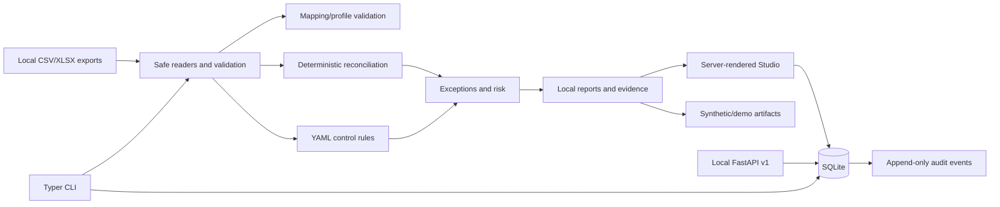

# Repository Audit: World-Class Foundation Slice

Audit date: 2026-07-21

Scope: repository structure, Python package, CLI, local API, Studio, database layer, tests, documentation, examples, control packs, CI, Docker assets, and release metadata. This audit describes repository evidence; it is not a production-readiness, compliance, or assurance assessment.

## Executive summary

ReconForge ERP is not an empty reconciliation prototype. The repository already contains a substantial early-stage, local-first finance-controls platform: a Typer CLI, deterministic reconciliation and rule engines, export-profile validation, report and evidence generation, an authenticated FastAPI foundation, SQLite migrations, RBAC, audit events, DB-backed close and account-reconciliation services, a server-rendered Studio, synthetic enterprise demo generation, 19 control packs, 46 pre-existing Python test files, and extensive operating and security documentation.

The safe next step is therefore additive. A modern web client should consume a narrow, versioned local contract while the current CLI, FastAPI routes, generated artifacts, and server-rendered Studio remain supported. Broad ERP transaction processing—posting, fulfillment, payroll, MRP, and similar modules—should remain a staged roadmap until domain models, persistence rules, controls, and tests exist.

## Repository inventory

| Area | Observed repository evidence |
| --- | --- |
| Python core | 141 tracked files under `reconforge/` across reconciliation, rules, risk, evidence, mappings, platform, DB, auth, workflow, API, Studio, reports, IO, anonymization, generation, and utilities |
| CLI | One Typer entry point with 30 top-level command groups/commands and more than 100 command handlers |
| API | FastAPI application factory and 10 v1 route groups for health/version, auth, users, roles, audit, workflow, accounts, close, exceptions, and metrics |
| Studio | Existing server-rendered FastAPI workspace with local reports, review actions, downloads, DB views, optional authentication, CSRF protection, and safe download registries |
| Storage | SQLite connection, schema, migrations, backup/restore, export/import bridge, and repository/service layers |
| Controls | 19 control-pack directories; each observed pack uses metadata, rules, mapping, risk model, README, expected-exception guidance, and sample command files |
| Examples | Canonical CSV/XLSX sample exports, anonymized data, expected-output guidance, synthetic generator, and enterprise demo generator |
| Tests | 46 tracked Python test files covering CLI, API, auth/RBAC, audit, workflows, DB services, reconciliation, rules, reports, evidence, paths, mappings, demos, and claim boundaries |
| Documentation | 150 tracked docs covering users, architecture, strategy, schemas, security, releases, deployment, mappings, controls, demos, and maintainership |
| Delivery | Dockerfile, Compose file, Makefile, pre-commit, CI, CodeQL, dependency/security workflows, release-integrated per-subject SBOM definition, Scorecard workflow, issue templates, and PR template |
| Static site | Small `site/` landing-page foundation, separate from product Studio |

Generated `output/`, caches, build products, benchmark output, and the local virtual environment were excluded from architectural conclusions.

## Current architecture

### Interface layer

- `reconforge/cli.py` is the first-class orchestration surface. It exposes validation, reconciliation, mapping, rules, reports, demos, reviews, close, accounts, approvals, evidence, journal controls, intercompany, matching, unified exceptions, metrics, operations, database, audit, users, roles, workflows, API, dashboard, Studio, and doctor commands.
- `reconforge/api/` provides a local/self-hosted FastAPI v1 foundation. Sensitive data routes require bearer-session authentication and RBAC permissions.
- `reconforge/studio/app.py` is a server-rendered FastAPI UI for local generated outputs and selected DB-backed services. It contains important compatibility and security behavior and should not be replaced in a frontend-only change.
- `reconforge/dashboard/app.py` serves generated dashboard artifacts.

### Domain and service layer

- `reconforge/reconciliation/`, `rules/`, `risk/`, `evidence/`, `review/`, `close/`, and `mappings/` contain the established export-based control workflow.
- `reconforge/platform/` contains DB-backed service foundations for accounts, close, approvals, controls, evidence, exceptions, intercompany, journals, matching, metrics, and operations.
- `reconforge/auth/`, `workflow/`, and `audit/` provide local users/RBAC, state machines, and append-only activity foundations.
- `reconforge/plugins/` is an export-adapter registry, not a direct ERP connector suite.

### Persistence and contracts

- Local files remain the canonical input/output boundary for core reconciliation workflows.
- SQLite is implemented for local/demo platform state. Migrations are explicit and database backups are covered by tests.
- Stable JSON schemas exist under `docs/schemas/` for selected artifacts, but there is not yet a complete cross-module ERP domain contract.
- PostgreSQL is a future architecture requirement, not implemented behavior.

### Delivery and trust

- Ruff, mypy, pytest, Bandit, pip-audit, CodeQL, Dependabot, SBOM, and OpenSSF Scorecard workflows are represented.
- Docker build automation exists. Runtime verification must remain an evidence-based release gate.
- The repository uses synthetic and anonymized examples and contains claim-boundary tests.

## Current strengths

1. Local-first behavior is reflected in code paths, docs, examples, and security guidance.
2. Reconciliation decisions are deterministic and explainable rather than hidden behind opaque scoring.
3. Security-sensitive path, HTML, YAML, download, authentication, and evidence behaviors have focused tests.
4. Generated evidence, checksums, review state, audit events, and provenance aids create a credible finance-controls wedge.
5. CLI breadth and test coverage provide a strong compatibility harness for incremental change.
6. The enterprise demo reuses real services to produce deterministic synthetic artifacts instead of relying on promotional mock data.
7. API, RBAC, workflow, and SQLite foundations already support a modern client without forcing a platform rewrite.
8. Documentation is unusually broad for an alpha-stage open-source project and consistently avoids direct-connector and assurance claims.

## Current gaps

| Gap | Current impact | Safe direction |
| --- | --- | --- |
| Modern client architecture | Existing Studio is useful but visually and structurally constrained by inline server-rendered HTML | Add `apps/web` as an experimental client while preserving the current Studio |
| UI data contract | Four narrow schema-versioned synthetic contracts now support the executive dashboard, exception queue, evidence binder, and inventory controls | Keep the bridge read-only and allowlisted; add authenticated live-mode adapters only as separate tested slices |
| ERP transactional core | No complete posting, subledger, order, inventory, manufacturing, HR, or POS transaction engine | Add bounded module foundations only after shared company, period, currency, audit, and authorization contracts |
| Module system | Plugin/export adapters exist, but there is no lifecycle-aware ERP module registry | Design activation, dependencies, migrations, permissions, events, and version compatibility before implementation |
| Database portability | SQLite is real; PostgreSQL support is not | Isolate repositories and transaction boundaries, then add contract tests before another backend |
| Frontend test/toolchain | No React/Vite/TypeScript workspace exists | Add isolated npm scripts, component tests, build checks, and browser screenshots |
| Documentation information architecture | Many valuable docs overlap across `docs/` and `docs/strategy/` | Add canonical architecture/product indexes and deprecate duplicates gradually |
| Release identity consistency | Source metadata and release tests say `v0.7.0`; the supplied repository instructions describe `v0.6.1` | Maintainers must resolve the authoritative release label; do not silently downgrade or advance it |
| Docker reproducibility in this checkout | Dockerfile now pins its base digest, checksum-pins uv 0.11.32, and installs the runtime-only universal lock; local Docker remains unavailable | Execute a clean hosted/local build, doctor, validation, exact-image scan, and rollback before any runtime/reproducibility claim |

## Risky areas

### Compatibility hotspots

- `reconforge/cli.py` is large and high-coupling. New commands should delegate to isolated typed modules and preserve existing names, defaults, output filenames, and exit behavior.
- `reconforge/studio/app.py` contains HTML escaping, CSRF, authentication, RBAC, file registries, and path safety logic. A visual rewrite inside this file would create avoidable security regression risk.
- Generated report filenames and JSON/CSV field names are consumed by tests, Studio, docs, and demo workflows.
- `reconforge/db/schema.py` and migrations serve many platform services. Schema additions require forward migration, compatibility notes, and rollback/restore tests.
- Control-pack loading must continue to use safe YAML parsing and supported Pydantic/operator boundaries.

### Product and claims risks

- A polished UI can be mistaken for completed ERP functionality. Every page or navigation item must disclose whether it is implemented, a foundation, or planned.
- “Connector” must continue to mean export profile/adapter unless a live integration is separately implemented and secured.
- Prepared/reviewed/certification metadata must not imply audit opinions, compliance certification, legal sign-off, or digital signatures.
- PostgreSQL, Kubernetes, scheduled jobs, external AI, and direct ERP connectivity remain planned until verified code and tests exist.

### Operational risks

- The checked-in `.venv` references a Python installation that is unavailable in the current environment. Validation should use a clean environment rather than treating this as an application defect.
- The current working tree already contains deletions of requirement input/lock files. Those changes predate this slice and must not be overwritten or implicitly attributed to it.

## Safe extension strategy

1. Preserve existing interfaces as the compatibility baseline.
2. Add a separate React application under `apps/web`; do not route existing `reconforge studio` users to it yet.
3. Feed the first UI with a deterministic, synthetic-only, versioned JSON artifact generated from existing enterprise-demo outputs.
4. Keep API authentication boundaries unchanged. A future browser client may use the local API after an explicit same-origin/auth/CSRF design.
5. Define shared platform primitives—organization, company, branch, fiscal period, currency, user/role/permission, audit event—before transactional module breadth.
6. Require each module slice to include typed models, service/repository boundaries, authorization, audit events, migration notes, synthetic fixtures, tests, and honest docs.
7. Keep experimental features behind explicit labels or flags until their contracts stabilize.
8. Use SQLite for local/demo workflows; introduce PostgreSQL through repository contract tests, not conditional SQL scattered through services.

## Backward-compatibility constraints

- Do not remove or rename current CLI commands or alter their default paths.
- Do not change existing report filenames, schema fields, review statuses, close statuses, or control-pack layout without a versioned migration.
- Do not weaken API authentication/RBAC or Studio authentication, CSRF, escaping, and download safeguards.
- Do not replace local CSV/XLSX inputs or local report/evidence outputs with mandatory database or network workflows.
- Do not introduce cloud upload, telemetry, paid APIs, or direct ERP credential handling into core workflows.
- Keep Python 3.11+ support and the existing `reconforge` package import path.
- Treat export profiles as local mapping support, never as vendor-certified or live connectors.
- Keep MIT licensing unless maintainers make a separate documented decision.

## Recommended PR sequence

1. Modern Studio shell and synthetic overview artifact bridge (completed foundation slice).
2. Versioned exception/evidence contracts plus native read-only pages backed by generated synthetic artifacts (completed foundation slice).
3. Read-only module registry metadata and validation (completed foundation slice); lifecycle activation remains future work.
4. Company/branch/period/currency foundation with migration 7, permissions, audit events, CLI/API, and snapshot schema (completed foundation slice); downstream foreign-key adoption remains future work.
5. Finance-core chart-of-accounts, dimensions, balanced control-ledger, trial-balance, migration, RBAC, API/CLI, backup, and contract foundation (completed foundation slice).
6. Inventory item/warehouse/location/stock-movement foundations tied to existing reconciliation controls (completed foundation slice with migration 9, exact quantities, local on-hand, API/CLI, RBAC, backup, and contracts).
7. Inventory count sessions and deterministic reorder signals (completed foundation slice with migration 10, repository boundary, RBAC/SoD, API/CLI, contracts, backup/export, and read-only synthetic Studio).
8. FIFO valuation layers, exact whole-valuation reversal, and explicit Finance Core Draft bridges (completed foundation slices with migrations 11-12, exact minor-unit costs, chronological consumptions, immutable Restore/Remove effects, compensating movements, RBAC/SoD, API/CLI/contracts, backup/restore/export, and read-only synthetic Studio).
9. Exact whole-valuation reversal (completed foundation slice with migration 12, separately Posted mirror movements, immutable `Restore`/`Remove` layer effects, debit/credit-swapped Finance Core Drafts with copied dimensions, protected evidence, distinct RBAC/SoD, API/CLI/contracts, backup/restore/export, and synthetic Studio visibility). Partial/chained reversal, analytic-dimension inference, other costing methods, and source-ERP writeback remain future work.
