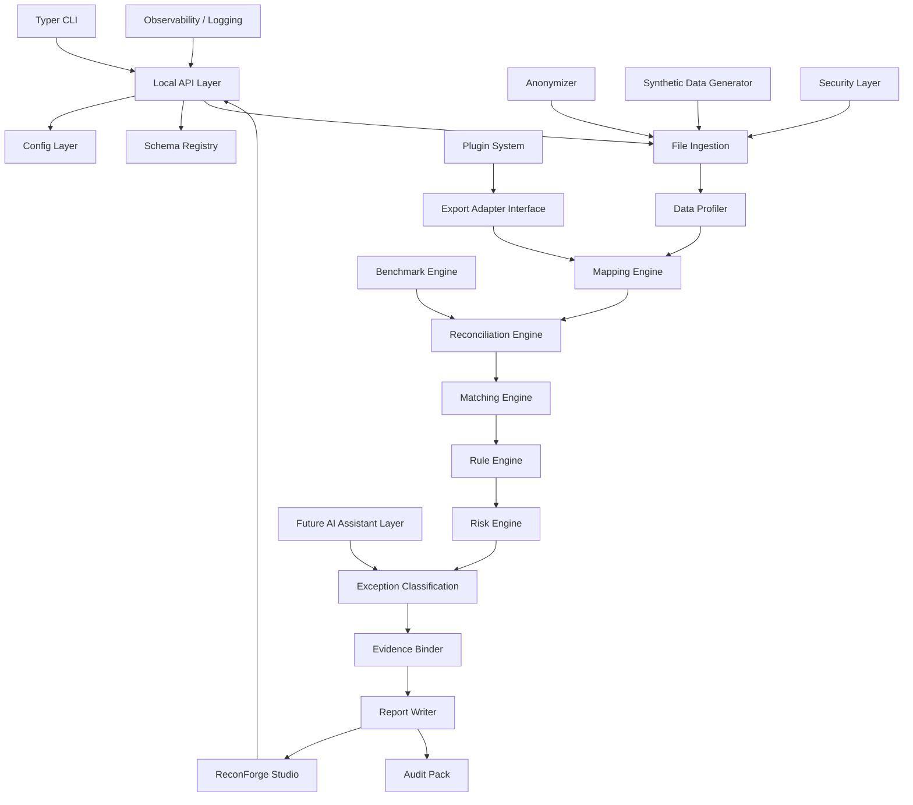
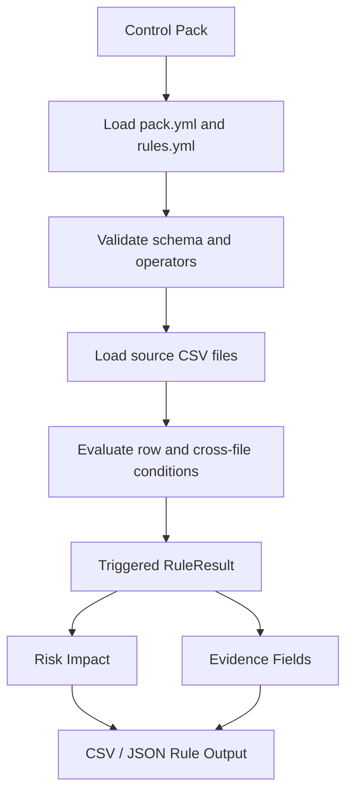
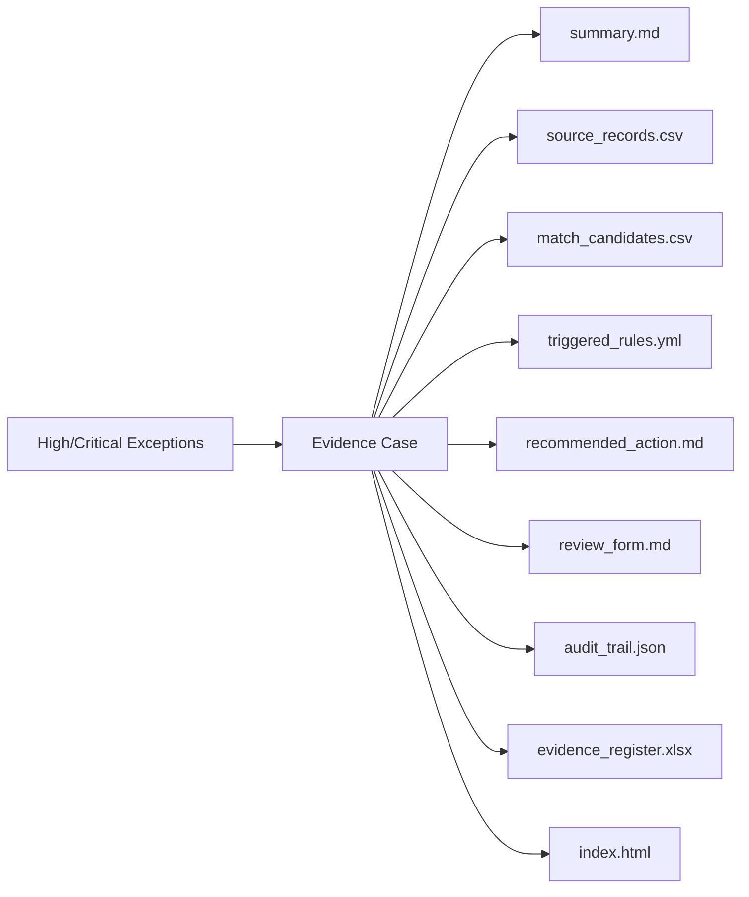
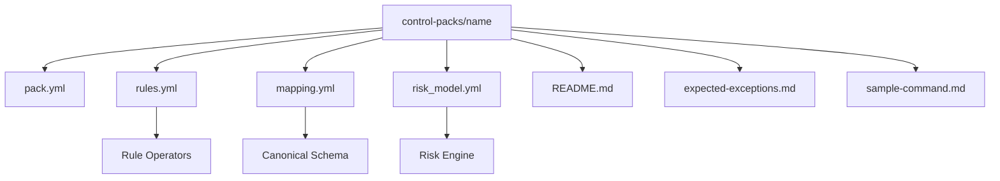
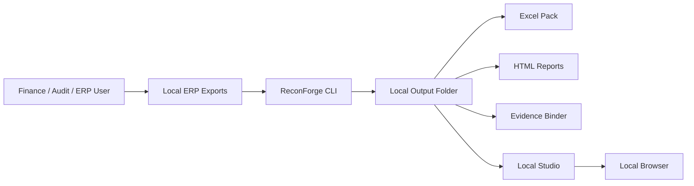
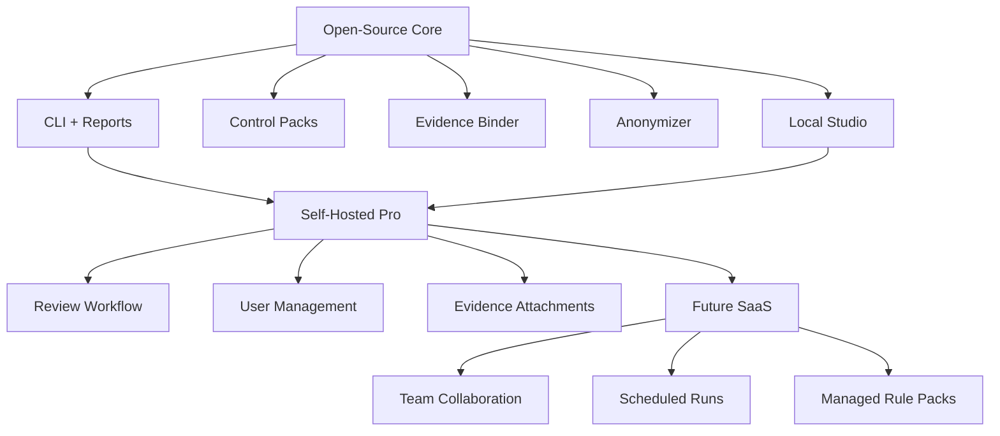

# Architecture

ReconForge ERP is a local-first ERP reconciliation and audit intelligence platform. It is designed around export-driven workflows and deterministic control logic.

## 1. System Architecture

## 2. Data Pipeline

```mermaid
flowchart LR
    A[ERP Exports] --> B[Ingestion]
    B --> C[Schema Validation]
    C --> D[Data Mapping]
    D --> E[Reconciliation Engine]
    E --> F[Rule Engine]
    F --> G[Risk Scoring]
    G --> H[Exception Classification]
    H --> I[Evidence Binder]
    I --> J[Review Workflow]
    J --> K[Management Reports]
    K --> L[Audit Pack]
    L --> M[Continuous Improvement]
```

## 3. Rule Engine Flow

## 4. Evidence Binder Flow

## 5. Control Pack Architecture

## 6. Local-First Deployment Model

No cloud upload is required for core functionality.

## 7. Future SaaS / Open-Core Architecture

## Module Responsibilities

| Module | Responsibility |
| --- | --- |
| CLI | Command orchestration |
| Studio web UI | Local review interface |
| API layer | FastAPI app boundaries |
| Config layer | Tolerances, mappings, risk settings |
| Schema registry | Canonical ERP file schemas |
| File ingestion | CSV/XLSX reading and normalization |
| Data profiler | Row counts, validation, quality warnings |
| Mapping engine | ERP export-to-canonical mapping |
| Reconciliation engine | Stock/GL, work orders, WIP |
| Matching engine | Strategies, confidence, explanations |
| Rule engine | YAML controls and cross-file checks |
| Risk engine | Scores, levels, escalation, audit notes |
| Control packs | Domain-specific controls |
| Evidence binder | Audit case folders and register |
| Report writer | Excel, JSON, CSV, Markdown, HTML |
| Anonymizer | Local risk reduction with referential linkage and mandatory review boundary |
| Synthetic generator | Demo and benchmark datasets |
| Benchmark engine | Runtime and output metrics |
| Plugin system | Export adapter/profile interface |
| Security layer | Local-first processing and disclosure-risk guidance |
| Observability/logging | Future run logs and diagnostics |
| Future AI assistant | Optional explanation layer, never required for core reconciliation |
