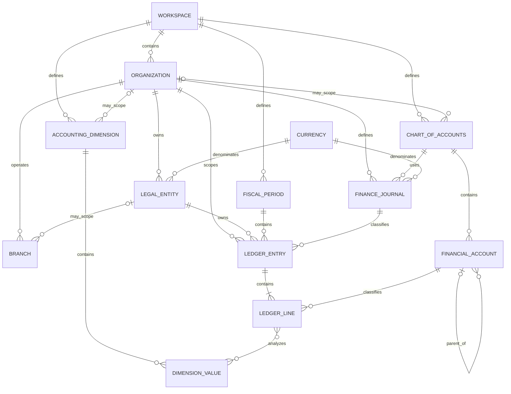
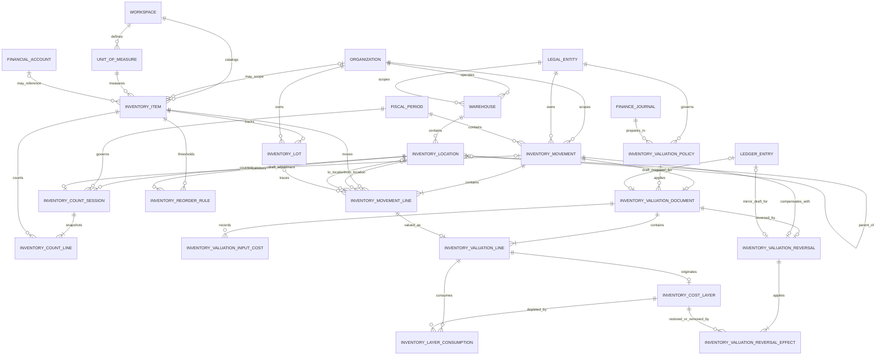

# Platform Data Model

ReconForge uses explicit local contracts rather than claiming a single universal ERP database. Three state boundaries coexist:

1. User-selected CSV/XLSX/JSON exports and generated report/evidence files remain the core reconciliation boundary.
2. SQLite stores local identity, workflow, audit, master-data, finance-control, and operational foundations.
3. The experimental React Studio reads bounded versioned synthetic artifacts; browser preferences remain browser-local.
4. Immutable object storage can retain replay-verifiable consolidation-translation results under explicit tenant/workspace scope; this does not create a ledger posting or a statutory statement.

No state boundary performs cloud upload, telemetry, source-ERP writeback, or hidden external API calls by default.

## Migration map

| Migration | Main responsibility |
| --- | --- |
| 1 | Workspaces, initial organizations/entities/periods/accounts, workflow references, and append-only audit ledger |
| 2 | Local credential and RBAC foundation |
| 3 | Governed workflow state-machine records and events |
| 4 | Hashed local API sessions |
| 5 | Legacy import/export bridge records |
| 6 | DB-backed finance-control workflow services |
| 7 | Organization codes, currencies, branches, fiscal metadata, and master-data permissions |
| 8 | Charts, expanded account hierarchy, dimensions, finance journals, balanced control entries, and finance-core permissions |
| 9 | Units, inventory items, warehouse/location hierarchy, lot/serial references, exact-quantity movements, and inventory permissions |
| 10 | Physical-count snapshots/lifecycle, deterministic reorder rules, and separate count/reorder permissions |
| 11 | Entity FIFO policies, exact inbound costs, immutable valuation/layer evidence, Finance Core Draft linkage, and valuation permissions |
| 12 | Exact valuation reversals, immutable Restore/Remove layer effects, mirror Finance Core Drafts, and separate reversal permissions |

Migrations are forward-only. Operational rollback uses a verified local backup. Supported older backups are loaded against their source schema and then upgraded with trusted local migrations.

## Organization and finance relationships

## Finance-core invariants

- Account hierarchy is acyclic and parents belong to the same chart.
- Account types and normal balances use bounded enumerations.
- Amount input is an exact decimal string or integer; storage uses signed-safe integer currency minor units.
- Each ledger line contains exactly one positive debit or credit.
- A ledger entry has 2–1,000 lines and balanced non-zero totals.
- Entry currency currently matches both journal and legal-entity currency.
- Posting date falls within an `Open` local fiscal period.
- Required active dimensions are present on every line.
- Known-user creators cannot validate their own entries.
- The only entry status sequence is `Draft -> Validated -> Voided`.
- Draft writes and validation hold one SQLite write boundary while rechecking references and balance.
- Database triggers independently require balanced validation metadata and prevent modification/removal of non-Draft headers, lines, dimension links, and review metadata.

`Validated` means locally reviewed control metadata. There is intentionally no `Posted` status: ReconForge does not write entries to a source ERP or claim that these records are statutory books.

## Inventory-core relationships

## Inventory-core invariants

- Quantity input is an exact decimal string or integer; storage uses a signed-safe scaled integer with fixed UOM precision from zero to six places.
- Receipt lines have only a destination, delivery lines only a source, and transfers require distinct source and destination locations. Adjustment lines contain exactly one side.
- Warehouses, locations, periods, entities, items, and tracked references must be active and scope-compatible at posting time.
- Lot-tracked items require a lot; serial-tracked items require a serial and move exactly one unit per line.
- Posting holds one SQLite write boundary while rechecking references, direction, protected-location non-negative stock, and global serial quantity.
- Known-user creators cannot post their own movements.
- The only movement status sequence is `Draft -> Posted -> Voided`.
- Posted headers and lines are immutable. Database triggers independently enforce review metadata, movement direction, transition order, and immutability.
- On-hand is derived from Posted, non-Voided local movements; it is never accepted as a separately editable balance.

`Posted` means included in the local inventory-control balance. It does not write to a source ERP, reserve or fulfill an order, calculate cost, create a finance-core entry, or certify a physical count.

## Inventory-planning invariants

- Starting a Draft count atomically freezes non-zero Posted balances for one Internal location into immutable item/lot lines.
- Count input is exact, non-negative, and constrained to the item's stored UOM precision.
- Submission requires all lines; known-user creators or submitters cannot approve their own count.
- Approval refuses stale snapshots when Posted balances changed after counting started.
- Non-zero approved variance creates a linked Draft Adjustment movement; it is never posted automatically.
- Count transitions are limited to `Draft -> Counting -> Submitted -> Approved`, with reasoned cancellation before approval.
- Reorder rules require `target > minimum >= 0`; signals use exact `target - on_hand` and never create purchasing documents.
- Count and reorder SQL is behind a repository protocol; SQLite is the only implemented backend.

## Inventory-valuation invariants

- Only Posted Receipt, Delivery, and non-zero Adjustment movements are eligible; Transfers remain quantity-only in this foundation.
- Inbound valuation requires one exact, non-negative total-cost string per movement line. Binary floating-point input is rejected.
- Money is stored in currency minor units; FIFO consumption is scoped by entity, item, UOM, and lot/serial and ordered by source movement date, valuation number, then line number.
- Approval rejects an earlier unvalued eligible movement, backdating after a later Approved valuation, insufficient layer quantity, and partial allocation that cannot be represented meaningfully in minor units.
- The only valuation transitions are `Draft -> Approved` and `Draft -> Cancelled`; known-user creators cannot approve their own documents.
- Approved lines, layer origins, consumption rows, and reversal effects are immutable. Layer remaining quantity/value may change only through matching immutable consumption or reversal evidence inserted in the same transaction.
- Approval atomically creates valuation evidence and one balanced Generated Finance Core `Draft`; it never validates or posts that entry.
- An Approved valuation blocks voiding its source movement and linked Finance Core entry. Migration 12 corrects it without deletion by linking an exact separately Posted mirror movement, applying exact FIFO `Restore`/`Remove` effects, and creating a debit/credit-swapped Finance Core `Draft`.
- A reversal must preserve scope, line order, item, UOM, lot/serial, quantity, and precision while swapping locations and using the inverse movement type. It cannot predate the original movement.
- An inbound layer can be removed only while untouched; dependent outbound valuations must be reversed first. Outbound reversal restores its exact recorded consumptions.
- Only `Draft -> Approved` and `Draft -> Cancelled` reversal transitions are allowed. Known-user creators cannot approve their own reversal, and an Approved reversal protects its mirror movement, Finance entry, lines, dimensions, header, and effects.
- Valuation SQL is behind a repository protocol; SQLite is the only implemented backend.

## Backward-compatible stock boundaries

| Record | Purpose | Mutation model |
| --- | --- | --- |
| Canonical `stock_moves.csv` inputs | Imported source evidence for existing reconciliation, WIP, workshop, and report workflows | Read from user-selected local exports |
| `inventory_movements` + `inventory_movement_lines` | Governed local exact-quantity control ledger | Draft creation, independent posting, reasoned void |

Migration 9 does not reinterpret, aggregate, or delete source export rows. A future import adapter may project selected source movements into Draft local movements only through an explicit versioned mapping contract.

## Backward-compatible journal boundaries

Two journal concepts are deliberately separate:

| Record | Purpose | Mutation model |
| --- | --- | --- |
| `journal_entries` | One row per imported source/export record for deterministic policy checks | Re-import/upsert from local files |
| `ledger_entries` + `ledger_lines` | Balanced local multi-line finance-control entry | Draft creation, independent validation, reasoned void |

Migration 8 does not reinterpret, aggregate, or delete the older policy-control records. A future import adapter may explicitly project source journal batches into Draft ledger-control entries through a versioned mapping contract.

## Identity, authorization, and audit

- Users, roles, permissions, and hashed sessions are local database records.
- Services enforce RBAC when the actor label resolves to a stored local user.
- Trusted labels such as `local-cli` preserve local single-user workflows and remain visible in audit events.
- Sensitive mutations append to the audit hash chain with bounded metadata.
- Audit hashes are integrity aids, not digital signatures or non-repudiation guarantees.

## File and browser contracts

- File readers resolve bounded local paths and reject traversal-oriented inputs.
- Generated HTML escapes user-controlled content.
- Public DB exports omit password verifiers and session material; full backups may contain credential verifiers and must be protected.
- Browser contracts project allowlisted values and omit database/evidence paths.
- JSON contracts under `docs/schemas/` are versioned independently of SQLite migration numbers.
- Consolidation translation v1 accepts balanced entity trial-balance lines and explicit approved rate lineage as immutable calculation inputs. It aggregates mapped group accounts and exposes an unposted translation-adjustment proposal; no database table or ledger status is added.

## Portability direction

SQLite is implemented and verified. PostgreSQL readiness is an architectural direction, not current support. Before another backend is claimed, repository contracts must cover transactions, foreign keys, recursive hierarchy reads, integer amount behavior, status-transition concurrency, migration equivalence, and backup/export semantics in CI.

## Known gaps

- The legacy workspace-wide unique account-code constraint limits reuse of the same code across multiple charts.
- Foreign keys have not replaced every free-text entity, period, account, and currency field in older finance-control tables.
- The translation artifact now retains explicit exchange-rate source/effective-time/digest and an operator-supplied adjustment account. Live rate feeds, functional-currency remeasurement, ownership/effective-date models, eliminations, non-controlling interest, consolidation journals, numbering sequences, tax, assets, budgets, broader inventory costing/accounting beyond the bounded FIFO foundation, and statutory statements require later bounded modules.
- SQLite databases are local trust-boundary artifacts and do not provide tenant isolation for a hosted service.
