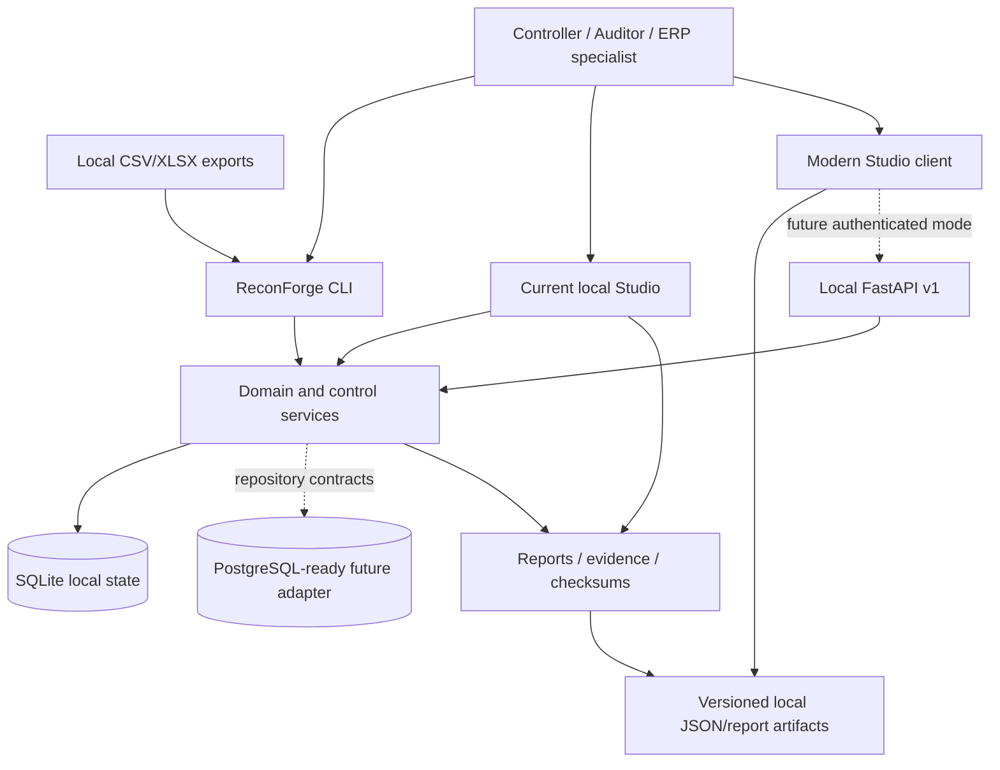
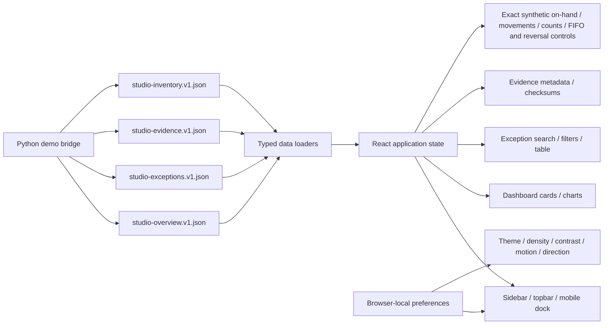
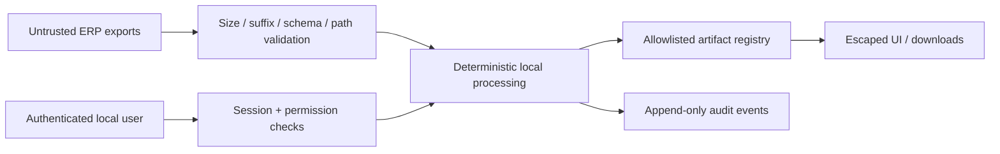

# ReconForge ERP Platform Architecture

Status: proposed direction for incremental implementation. Existing released interfaces remain authoritative.

## Architectural intent

ReconForge should evolve into a modular ERP and finance-controls platform without discarding its strongest property: local, inspectable workflows built from user-provided exports and deterministic control logic. The target is a monorepo with one preserved Python core, a modern optional client, typed local contracts, and staged domain modules.

This document does not claim completed ERP transaction processing, PostgreSQL support, Kubernetes support, live connectors, hosted services, or production readiness.

## Target context



## Monorepo direction

The structure grows around the current repository; it is not a mass move:

```text
reconforge-erp/
  reconforge/              # Preserved Python package and first-class CLI/API
    api/
    audit/
    auth/
    db/
    domain/
    platform/
    reconciliation/
    rules/
    studio/                # Existing server-rendered Studio
    workflows/             # Add only when existing workflow package is migrated deliberately
  apps/
    web/                   # Experimental React/Vite/TypeScript Studio
  packages/                # Future generated SDKs and scaffolding, when contracts stabilize
  control-packs/           # Existing deterministic control packs
  connectors/              # Future export-profile packaging; not live connectors by default
  examples/                # Existing samples plus staged industry demos
  docs/
    analysis/
    architecture/
    product/
    adr/
  tests/                   # Existing tests; split by layer only when it improves ownership
  deploy/                  # Future, after deployment artifacts are verified
```

Avoid placeholder directories with no owner or contract. A directory is introduced when its first working slice lands.

## Architectural layers

### 1. Interface adapters

- CLI commands parse options, call typed application services, and translate known failures into safe user messages.
- FastAPI routes validate HTTP contracts, enforce authentication/RBAC, call services, and avoid raw exception leakage.
- The current Studio remains a supported local adapter.
- The modern Studio consumes either synthetic/versioned local artifacts or authenticated same-origin API contracts.

Interfaces do not own reconciliation, posting, matching, or workflow rules.

### 2. Application services

Application services coordinate use cases such as run reconciliation, review exception, prepare account, update close task, register evidence, or build a demo view. They own authorization preconditions and transaction boundaries but delegate calculations to domain services.

### 3. Domain modules

Each module owns its language, invariants and events. Initial bounded contexts:

- Platform core: organization, company, branch, period, currency, user, role, permission, audit event, import job and attachment metadata.
- Finance controls: account reconciliation, close, journals, evidence, control testing, variance and intercompany.
- Inventory controls: stock movement, valuation evidence, counts and exceptions.
- Manufacturing/workshop controls: work orders, WIP, material issues, completions, scrap, quality and returns.
- Shared reconciliation: match jobs, candidates, decisions, exceptions, risk and evidence lineage.

Source ERP transaction execution remains out of scope until a module has explicit invariants and tests.

### 4. Ports and adapters

Domain/application code depends on protocols for repositories, clocks, ID generation, audit sinks, file stores and event publication. SQLite implementations remain default. A PostgreSQL adapter can be added later through the same contracts and test suites.

### 5. Generated artifacts

JSON/CSV/XLSX/HTML/evidence outputs remain first-class. Contracts require:

- `schema_version`;
- generation timestamp and source/provenance metadata;
- explicit `synthetic_data_only` markers for demo data;
- safe relative references rather than arbitrary file serving;
- deterministic ordering where practical;
- checksum manifests for evidence/handoff artifacts.

## Local-first runtime modes

| Mode | Inputs | State | UI | Network |
| --- | --- | --- | --- | --- |
| File workflow | Local CSV/XLSX | Local output folder | Generated reports/current Studio | None required |
| Local platform | Local imports | SQLite | Current Studio and local API | Loopback only by default |
| Modern demo | Synthetic enterprise-demo JSON | Static local files | `apps/web` | None after local build |
| Future self-hosted | Explicit imports | PostgreSQL-ready adapter | Modern Studio + authenticated API | Operator-controlled private network |

No mode uploads ERP data or enables telemetry by default.

## Modern Studio architecture



The current client slice is intentionally read-only and synthetic. It proves design tokens, responsive navigation, accessibility settings, localization direction, history-based dashboard/exception/evidence/inventory routes, nested runtime validation, loading/empty/error states, component tests and screenshot generation. The executive dashboard derives its decision brief, close-readiness score, four control-domain scores, and entity risk concentration from generated package metrics rather than hand-authored presentation values. Its guided control story links those signals to real contract-backed exception, evidence, and inventory views. Evidence browser payloads contain allowlisted metadata and checksums, never source paths. Inventory browser payloads contain allowlisted exact-quantity, FIFO-value, exact-reversal summary, and Finance Draft-reference rows, but no database, credential, or file-path fields. It does not approve valuation or reversal, validate Finance Core entries, bypass API authentication, or replace the current Studio.

Future live mode requirements:

1. Same-origin deployment or an explicit CORS policy limited to configured local origins.
2. Session model suitable for browsers, with CSRF protection for mutations.
3. Permission-to-route and permission-to-action mapping.
4. API contract generation and compatibility tests.
5. No arbitrary filesystem URLs in browser payloads.

## Module contract

The initial read-only module registry implements this metadata contract for shipped runtime slices. Inspect it with `reconforge modules list`, `reconforge modules show <id>`, and `reconforge modules validate`. Planned-only work is excluded from runtime discovery.

Every module foundation must declare:

- stable module ID, semantic version and experimental/stable state;
- dependencies and incompatible versions;
- permissions and default role mapping;
- database migrations and rollback/restore note;
- domain events and audit-event mapping;
- API/CLI/UI exposure;
- import/export schemas and synthetic fixtures;
- data classification and retention notes;
- unit, repository contract, API/CLI and security tests.

Registry inspection does not import arbitrary plugins, mutate activation state, initialize a database, or make network calls. Dynamic installation, lifecycle hooks, and migrations owned by third-party packages remain future design work.

Module activation must be explicit. A disabled module must not create background work or external network calls.

## Data model principles

1. Company and period scope are explicit on financial/operational records.
2. Money stores amount plus currency; conversion includes rate source and effective date.
3. Posted/accounted records are immutable or reversed, not silently edited.
4. Source document identifiers and import provenance survive every transformation.
5. Audit events record actor label/ID, action, object, timestamp and safe metadata.
6. Evidence paths are registry-controlled and checksummed.
7. User-controlled labels are escaped at presentation boundaries.
8. Synthetic data is unmistakably marked.

The first governed implementation of principle 1 is the migration-7 `platform.master-data` module. It supplies organization/entity/branch/currency/fiscal-period references, RBAC, audit events, non-overlap checks, controlled period metadata transitions, and a versioned path-free snapshot.

Migration 8 adds the experimental `finance.core` control ledger: chart and account hierarchy, dimensions, organization-scoped journals, entity/period-linked balanced entries, exact currency minor units, creator/validator separation, immutable Validated lines, and a path-free trial-balance contract. It deliberately keeps the existing export-policy `journal_entries` table separate and does not introduce source-ERP posting.

Migration 9 adds the experimental `inventory.core` movement ledger: governed units and items, entity-scoped warehouse/location hierarchy, lot/serial references, exact scaled quantities, creator/poster separation, protected-location and serial checks, immutable Posted lines, derived on-hand, and deterministic local control exceptions. It deliberately keeps canonical `stock_moves.csv` evidence separate and does not introduce costing, fulfillment, finance posting, or source-ERP writeback.

Migration 10 adds inventory planning controls: immutable non-zero location-count snapshots, exact count results, reasoned submission and known-user independent approval, stale-balance rejection, generated Draft variance adjustments, and deterministic reorder advice. It does not post adjustments or create purchasing documents.

Migration 11 adds the first bounded monetary inventory slice: entity FIFO policies, exact inbound total-cost evidence, chronological Approved cost layers and consumptions, and an atomic balanced Finance Core Draft bridge. `InventoryValuationService` depends on an explicit repository protocol. Approval never validates the Finance Core entry, and the slice excludes AVCO, landed cost, manufacturing costing, required-dimension inference, foreign-currency conversion, and source-ERP writeback.

Migration 12 adds the bounded correction slice: one Approved valuation can link to a separately Posted exact opposite movement, apply immutable FIFO `Restore` or `Remove` effects, and atomically prepare a debit/credit-swapped Finance Core Draft. `InventoryValuationReversalService` uses its own repository protocol and separate manage/approve permissions. It preserves all original evidence and excludes partial reversal, reversal-of-reversal orchestration, automatic Finance Core validation, and source-ERP writeback.

## Storage and migration strategy

### SQLite now

- Continue current explicit migrations.
- Use foreign keys, transactions and deterministic service behavior.
- Keep one database per local workspace unless multi-workspace isolation is designed explicitly.
- Back up before migrations and test restore/verification.

### PostgreSQL-ready later

- Introduce repository protocols around aggregate/use-case operations.
- Add backend-neutral contract tests before a PostgreSQL implementation.
- Avoid SQLite-specific SQL in application services.
- Define isolation, locking and sequence semantics for posting/numbering use cases.
- Do not claim support until migrations and the full contract suite run against PostgreSQL in CI.

## API design

- Preserve `/api/v1` and additive compatibility.
- Use Pydantic request/response models with `extra="forbid"` for mutations.
- Return structured safe errors and request IDs; never raw tracebacks.
- Require authentication and least-privilege permissions for business data.
- Add cursor pagination before large transaction collections.
- Add idempotency keys for future import and mutation jobs.
- Expose metric lineage with metric values.
- Generate SDKs only after schemas stabilize.

## Security model summary

Trust boundaries:



Required controls include safe YAML parsing, resolved-path checks, allowlisted downloads, HTML escaping, CSRF protection for browser mutations, bounded imports, no raw exception leakage, checksum verification, secure password hashing, session expiry/revocation, and no default external calls.

## Feature flags and maturity labels

- `stable`: compatibility policy applies.
- `beta`: implemented and tested, but contract may evolve with migration notes.
- `experimental`: opt-in, may change, and cannot be represented as completed ERP scope.
- `planned`: documentation only; not present in runtime registries.

The modern Studio begins as `experimental`.

## Observability and jobs

The local default uses structured local logs and DB job records without telemetry. Future background jobs require explicit state transitions, retry ceilings, cancellation, safe error summaries and audit events. Network connectors remain disabled unless configured by an operator.

## Compatibility and migration

- Existing CLI, report filenames, schemas, statuses and routes remain supported.
- New contracts are additive and versioned.
- Breaking schema changes require parallel readers or an explicit migration command and release note.
- The modern client ships alongside the current Studio until functional, security and accessibility parity is demonstrated.
- Directory reorganizations happen only with import shims and test coverage.

## Quality gates

Python:

```bash
python -m ruff check .
python -m mypy reconforge
python -m pytest
python -m bandit -q -r reconforge
uv lock --check
python .github/scripts/validate_supply_chain_policy.py --project-root .
```

The security workflow exports all Python extras from `uv.lock` with hashes and
runs pip-audit under Python 3.11/3.12; npm and secret gates are defined in the
[supply-chain policy](../security/supply-chain-policy.md).

Modern Studio:

```bash
npm --prefix apps/web run typecheck
npm --prefix apps/web test -- --run
npm --prefix apps/web run build
npm --prefix apps/web run e2e
```

Docker runtime and other deployment claims require live smoke evidence.
