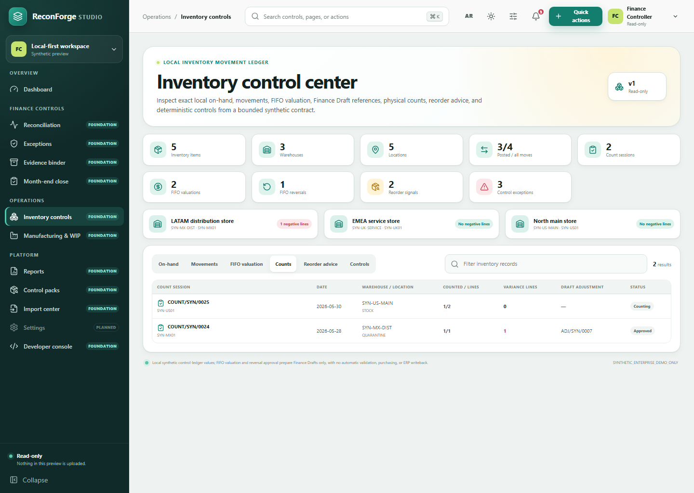

# Inventory Counts and Reorder Signals

ReconForge includes an experimental local inventory-planning foundation backed by SQLite migration 10. It adds governed physical-count sessions and deterministic reorder advice to the existing local inventory-control ledger.

This slice is deliberately bounded. It does not create purchase orders, reserve inventory, calculate demand forecasts, automatically value stock, validate finance entries, update a source ERP, or certify a physical inventory. An approved non-zero count creates a reviewed **Draft** local adjustment movement; posting that movement remains a separate inventory-core action, and optional [FIFO valuation](inventory-valuation.md) is another separate review action after posting.



## Count lifecycle

The only allowed transitions are:

```text
Draft -> Counting -> Submitted -> Approved
  |          |             |
  +----------+-------------+-> Cancelled
```

- Creating a count validates an active organization, entity, warehouse, Internal location, Open fiscal period, and in-period count date.
- Starting takes an immutable snapshot of every non-zero Posted local balance at the selected location, split by item and lot/serial.
- Counting accepts exact non-negative decimal strings at the item's UOM precision.
- Submission requires every snapshot line to be counted and records a reason.
- Approval rechecks the period and refuses stale snapshots if any Posted balance changed after the count started.
- A known local user cannot approve a count they created or submitted.
- Non-zero variances create one generated Draft Adjustment movement linked to the count. Zero-variance counts create no movement.
- Started headers, snapshots, completed results, and lifecycle metadata are protected by database triggers.

Locations with no non-zero Posted local balances cannot be started in this foundation. Blind counts, zero-balance item schedules, count freezes, mobile scanning, recount waves, and partial-location ranges remain future work.

## CLI workflow

```bash
reconforge inventory planning count-create --db output/reconforge.db \
  --number COUNT/2026/001 --organization SYN --entity EG01 \
  --period-id PER-... --warehouse MAIN --location STOCK --date 2026-07-20

reconforge inventory planning count-start --db output/reconforge.db \
  --session-id ICNT-... --actor preparer

reconforge inventory planning count-record --db output/reconforge.db \
  --session-id ICNT-... --line-id ICNL-... --quantity 9.875 \
  --note "Synthetic physical observation" --actor preparer

reconforge inventory planning count-submit --db output/reconforge.db \
  --session-id ICNT-... --reason "Count completed" --actor preparer

reconforge inventory planning count-approve --db output/reconforge.db \
  --session-id ICNT-... --reason "Independent variance review" --actor reviewer
```

Use `counts`, `count-show`, `count-cancel`, `summary`, and `snapshot` for inspection and lifecycle control.

## Reorder advice

A rule belongs to one active stock/consumable item and one Internal location. It stores exact minimum and target quantities at the item's UOM precision, plus bounded lead-time metadata. The target must be greater than the non-negative minimum.

```bash
reconforge inventory planning reorder-upsert --db output/reconforge.db \
  --organization SYN --entity EG01 --item MAT-01 \
  --warehouse MAIN --location STOCK --minimum 10.125 --target 20.000 \
  --lead-time-days 7

reconforge inventory planning reorder-signals --db output/reconforge.db \
  --organization SYN --entity EG01
```

An active rule emits a deterministic signal when local Posted on-hand is at or below its minimum. The suggested quantity is exactly `target - on_hand`; negative on-hand is rated `high`, otherwise `medium`. Signals are advice only and cause no movement, RFQ, purchase order, notification, external call, or ERP writeback.

## Permissions

| Permission | Default roles | Scope |
| --- | --- | --- |
| `inventory.read` | admin, controller, preparer, reviewer, auditor-readonly | Read counts, rules, signals, summaries, and snapshots |
| `inventory.count.manage` | admin, controller, preparer | Create, start, record, submit, or cancel Draft/Counting counts |
| `inventory.count.approve` | admin, controller, reviewer | Approve or cancel Submitted counts, subject to SoD |
| `inventory.reorder.manage` | admin, controller, preparer | Create, update, activate, or deactivate reorder rules |

Trusted labels such as `local-cli` preserve single-user local compatibility and remain visible in audit events. SoD checks apply when the actor resolves to a stored local user.

## Authenticated API

Read routes:

- `GET /api/v1/inventory-planning/summary`
- `GET /api/v1/inventory-planning/snapshot`
- `GET /api/v1/inventory-planning/counts`
- `GET /api/v1/inventory-planning/counts/{session_id}`
- `GET /api/v1/inventory-planning/reorder-rules`
- `GET /api/v1/inventory-planning/reorder-signals?organization=SYN&entity=EG01`

Mutation routes:

- `POST /api/v1/inventory-planning/counts`
- `POST /api/v1/inventory-planning/counts/{session_id}/start`
- `POST /api/v1/inventory-planning/counts/{session_id}/lines/{line_id}`
- `POST /api/v1/inventory-planning/counts/{session_id}/submit`
- `POST /api/v1/inventory-planning/counts/{session_id}/approve`
- `POST /api/v1/inventory-planning/counts/{session_id}/cancel`
- `POST /api/v1/inventory-planning/reorder-rules`

API request objects reject unknown fields. API list pages default to 500 rows and cap at 1,000.

## Contracts, storage, and recovery

- `inventory_count_session.schema.json` documents one detailed count response.
- `inventory_planning_snapshot.schema.json` documents the bounded count-header/rule snapshot.
- `inventory_reorder_signals.schema.json` documents exact deterministic advice.
- `studio_inventory_control.schema.json` includes allowlisted synthetic count and reorder records for the read-only modern Studio.

Public DB export includes count sessions, lines, and reorder rules in `inventory.json`. Local backups preserve all three tables and replay count transitions after restoring lines so SQLite lifecycle triggers remain authoritative. The service depends on an explicit repository protocol; SQLite is implemented, while PostgreSQL remains an unclaimed architectural direction.

## Current limitations and next boundary

- A separate migration-11 FIFO layer and Finance Core Draft bridge now exists. Count approval does not invoke it; AVCO, landed cost, layer aging, automatic Finance Core validation, and ERP posting remain unimplemented.
- No automatic replenishment, supplier selection, purchase workflow, demand forecast, safety-stock formula, or notification exists.
- The generated adjustment is Draft and must be reviewed/posted separately.
- Counts cover the non-zero Posted local snapshot for one Internal location; they are not an ERP-wide freeze or blind-count certification.
- The modern Studio surface is read-only and synthetic-only.

The next safe planning slice is supplier-independent replenishment planning or count-scope expansion. It must keep advice separate from procurement, preserve count evidence, and avoid silently reinterpreting Posted quantities or source-export reconciliation data.
